---

marp: true
theme: cate-theme
paginate: false
header: ILIAS DevConf September 2023 | cate-tms.de
footer: No ILIAS on a dead planet.

---

<!-- _class: title-01 -->

# **The UI that users, designers and frontend developers really want**

---


## What's in it for you?

* using the perspective of users, concepters, designers, frontend developers
* to find the best possible solutions for your UI projects
* handy checklist: questions worth answering

---

## We do lots of UI stuff for ILIAS

* Yvonne Seiler, University of Bern
* Ferdinand Engländer, CaT Concepts and Training GmbH

---

<!-- _class: chapter-01 -->
# **What would be the most direct user interface?**

---

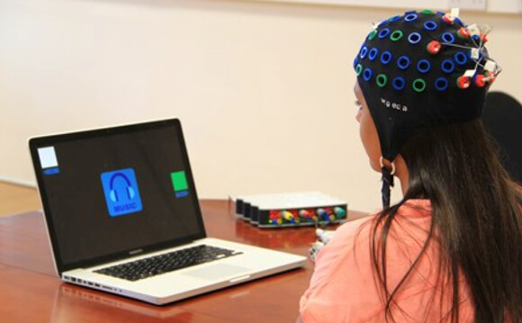

## Mind Reading Interface

* just think "register me" and it happens
* no need to type your own name on a keyboard
* no need to click on submit

---

## GUIs are always a compromise

* finding the correct button always takes effort
* and all other buttons that we are currently not looking for are technically in the way

---

So maybe the title of this presentation should be different
* "The UI that users, designers and frontend developers really want"
* "The UI that users, designers and frontend developers are the least frustrated with"

---

## Sources of frustration

* **users** will always have to look for something and learn how to use an interface (even if it's brief)
* **designers** will always have designs they aesthetically like more, but that are too impractical for users or not technologically feasable
* **(frontend) developers** often need to settle with "good enough for now" and the jungle of decade old code from hundreds of contributers

---


## Humans don't want to be frustrated

---

Making good UI can often be about...

* identifying sources of frustration with regards to using and coding the UI in ILIAS
* evaluating who gains what from minimizing them
* evaluating what effort it takes to minimize them

---

### Goals for the process:

* define a goal, to stay goal-oriented
* replace feeling/opinion with proven UI concepts
* avoid noodeling
* avoid making somebody else's life harder

---

<!-- _class: chapter-01 -->

# **Example**

## **View Control Mode**

---

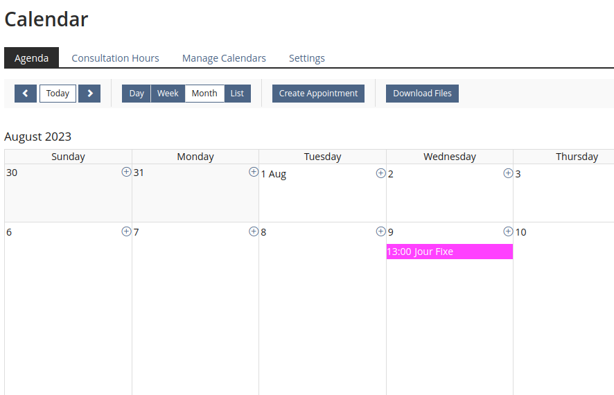

---

This works as it should in the calendar:

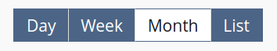

---

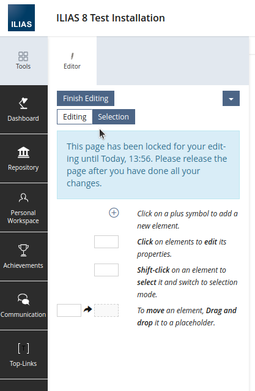

But what about here?

---


Which one is active?

* Communication problem
  * clear with more than 2 buttons
  * unclear with less than 3 buttons

---

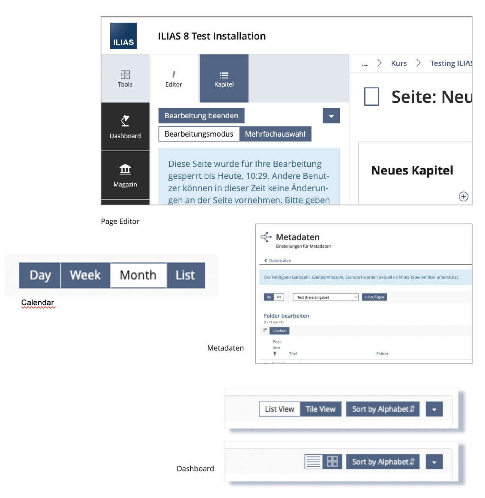

---

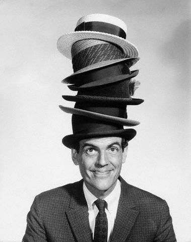

To find a satisfying solution let's wear all the different hats:

* User
* Designer
* (Frontend) Developer

---

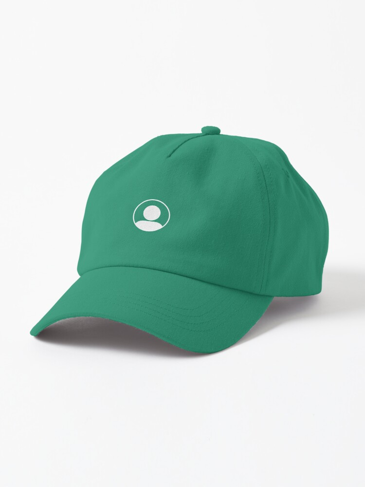

## The user
  * wants to quickly change a mode
  * is unsure which state is currently active = frustration
  * frustrated user feedback

---

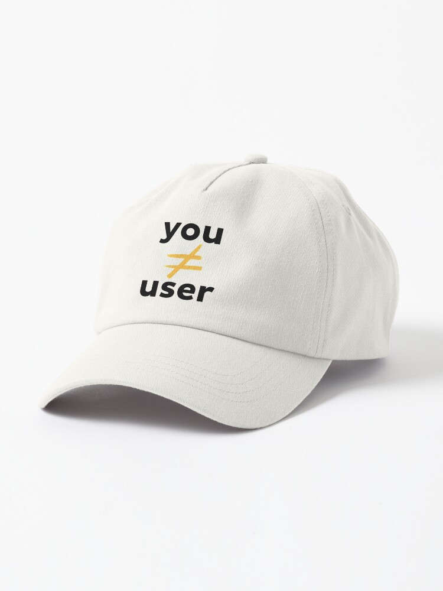

## The designer

* diagnosis
  * user intent seems clear
  * mental model mismatch
* goal: find a solution to visually communicate the active state more clearly

---

### Frustrations to look out for

* design can be pretty, but unclear
* anticipating limitations for implementation

---

### Exploration

* Collecting many possible approaches
* Because the first idea is rarely the best
* Let's not be picky yet, maybe an odd ideas leads to a better one

---

### Good brainstorming technique

Think about, what we don't want

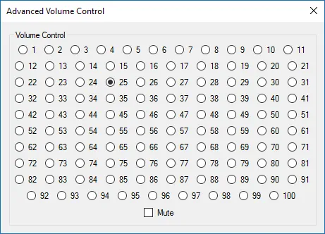

---

### Our options

* Changing the look of the btn-default engaged
* Switching to a different look when less than three buttons
* Changing to another/new UI component? Are these tabs?
* Changing the look of the ViewControl mode

---

### Evaluating the ideas

---

* Changing the look of the btn-default engaged
  * already didn't work out Mantis #30291
* Switching to a different look when less than three buttons
  * one more thing the user migth be confused about
* Changing to another/new UI component? Are these tabs?
  * No, it's the same data, not different pages.
* Changing the look of the ViewControl mode
  * seems promising, the ViewControl Mode isn't fullfilling a basic function it should have

---

### Exploration/Research for our choice

---

#### How did Bootstrap do it?

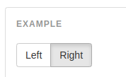

* inset shadow is not a communication tool we yet use, it's explicitly removed in delos scss code

---

#### Other solutions?

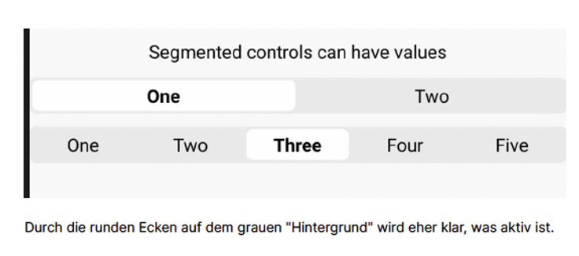

* rounded corners communicate a elevated level - something that is rarely used in ILIAS 8

---

### Experimentation to definition

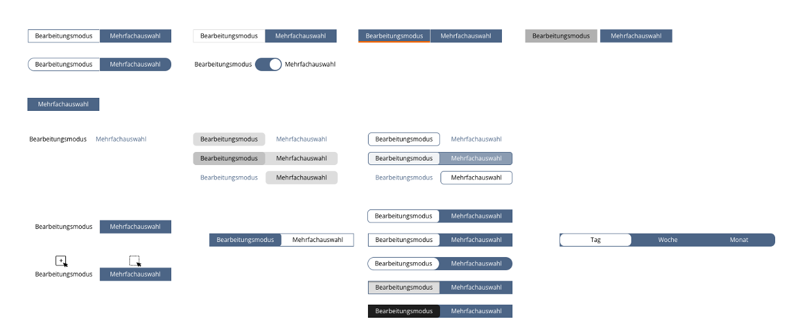

---

### Tests/Mockups

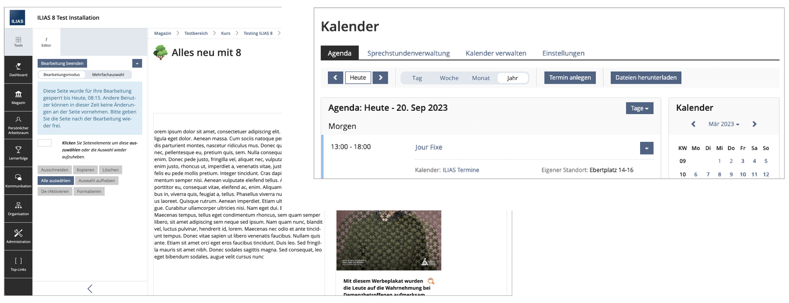

---
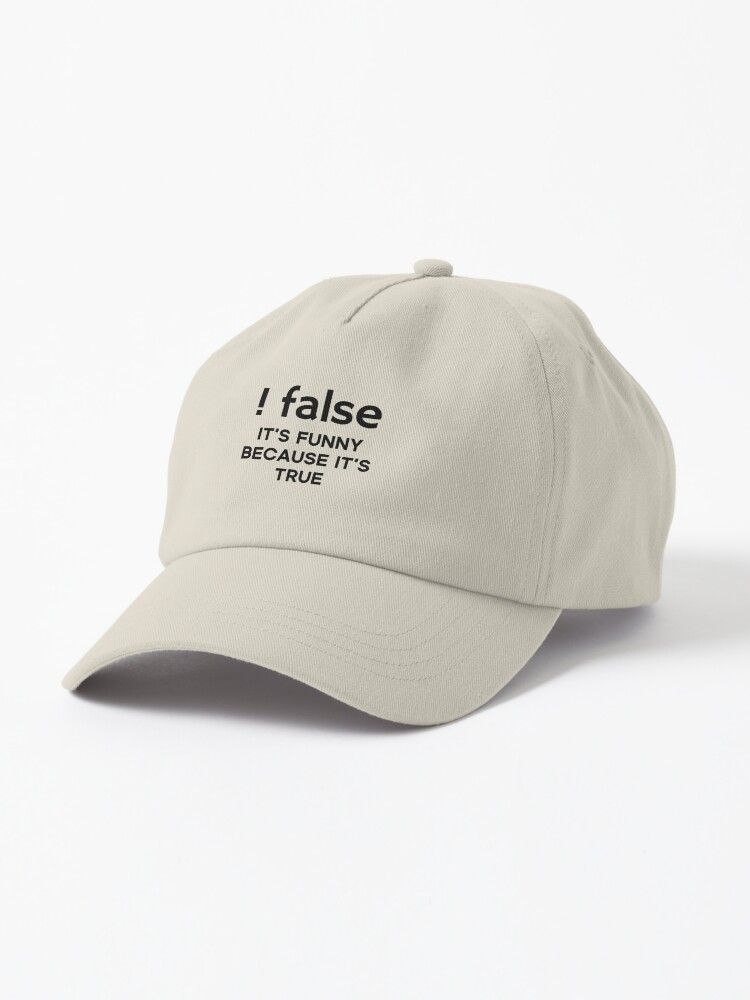
## (Frontend) Developer(s)

* creates the actual code that makes this UI component appear in ILIAS

---

### Exploration / Strategy

php: not much to explore
* ViewControl Mode already is a modern UI component, part of the Kitchen Sink
* views and components already use it, so construction should stay the same
* the need to change it is purely visual
* (for now)

---

sass: more decisions to make
* bootstrap has been removed in ILIAS 9, but the btn-group that this is based on has been integrated into delos
* php UI components are not equal scss components/layout/tools
* usually buttons are created by a button variant mixin inside the button. Do we have a new button type here?

---

### Frustrations to look out for

* design revisions that change code
* difficult to maintain code (structure, naming, comments)
* unit tests

---

### Definition / Decision

* new button type
* making use of the new ITCSS structure in ILIAS 9

---

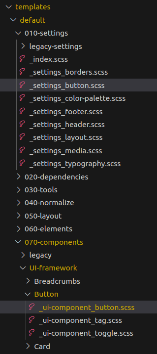

### Places for changes

* Settings layer
* Button component
* maybe small changes to viewcontrol component
* HTML Template

---

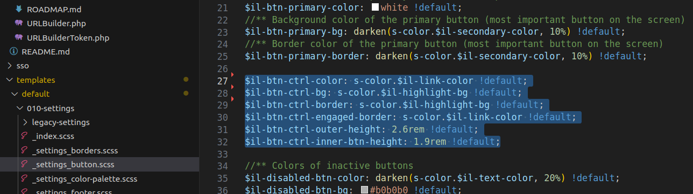

---

070-components/UI-framework/Button

```scss
.btn-primary {
  @include make-button($set-basics: false, $set-design: true,
    $button-color: s.$il-btn-primary-bg,

    $bg-color: s.$il-btn-primary-bg,
    $text-color: s.$il-btn-primary-color,
    $border-color: s.$il-btn-primary-border,

    $disabled_bg-color: s.$il-disabled-btn-bg,
    $disabled_text-color: s.$il-disabled-btn-color,
    $disabled_border-color: s.$il-disabled-btn-border,
    
    $engaged_bg-color: $il-engaged-btn-bg,
    $engaged_text-color: $il-engaged-btn-color,
    $engaged_border-color: s.$il-btn-primary-border,
    $engaged_border-width: 1px);
}

.btn-ctrl {
  @include make-button($input-field-height: s.$il-btn-ctrl-outer-height,
    $border-radius: s.$il-border-radius-secondary-large,
    
    $button-text-color: s.$il-btn-ctrl-color,
    $button-color: s.$il-btn-ctrl-bg,
    $border-color: s.$il-btn-ctrl-border);
  &.engaged,
  .open & {
    border: 1px solid s.$il-btn-ctrl-engaged-border;
    background-color: s.$il-main-bg;
  }
  .open & {
    box-shadow: none;
  }
}
```

---


## also... Accessibility

* let's put the designer hat back on for a second

---


* contrast is not the best

---

Final Implementation has an extra outline

* normal vision: 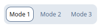
* high contrast: 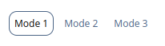

---

### New Discovery

It's good that UI components get less visual priority than buttons


---


## When reality is catching up

Developer hat back on...

---

Still a lot to be improved around ViewControls

* the Kitchen Sink buttons do not know the button btn-ctrl, maybe a context renderer could always output btn-ctrl if buttons are rendered inside viewcontrols?
* some View Controls use Kitchen Sink button defaults, other construct dropdowns through html templates that look like buttons, but are technically their very own specific construct
* View Controls in panel header have to get tweaked styling
* Input ViewControls present a better way to collect and send the settings of many ViewControls

---

## Result


* User: Can now differentiate active/inactive mode
* Designer: Has new approaches to clarify the visual hierachy of ViewControls in general
* Frontend Developer: Structure and use of mixins make it easy to find, improve and re-use this new button type in the future

---

## "But we don't have time to make UI concepts"

* looks like a lot
* ViewControl Mode update  2 days spread out over two weeks
  * incl. discussion in UI Clinic > mockups > realizing ViewControls are different from default buttons > collecting feedback > implementation
* saves time compared to:
  *  implementation > negative feedback > implementing something else > new idea > implementing something else

---

<!-- _class: chapter-01 -->

# **Honorable Mentions**

---

## Data Table
---

### Column types

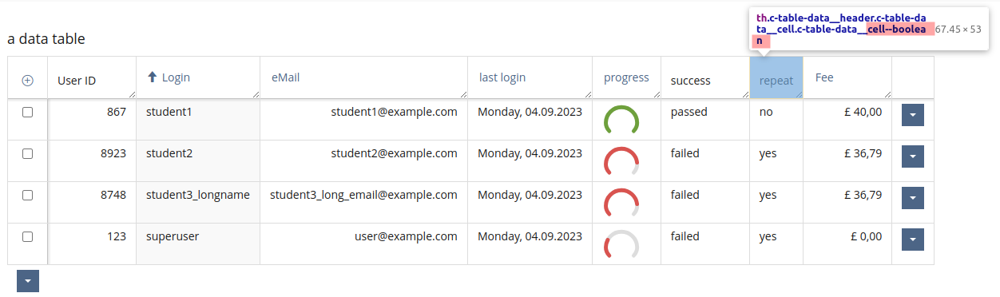

---

### Sticky header

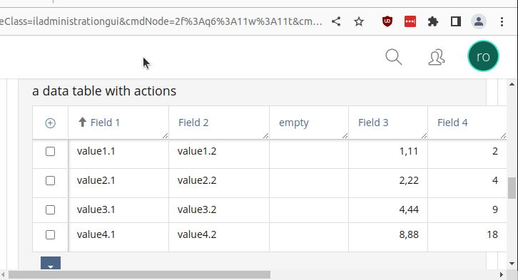

---

### Catch many lines of text

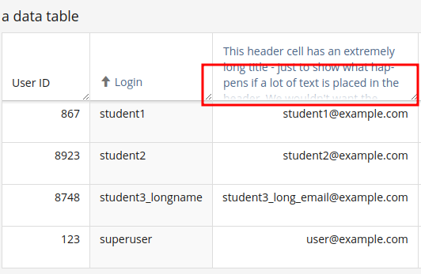

---

<!-- _class: chapter-01 -->

# **UI questions worth considering**

## **Download: tinyurl.com/ilias23-ui-questions**

---

## General

* What proven UI/UX principles, code structure, and testing data can we use instead of just relying on our gut instinct?
* **Who can *contribute* their knowledge, skills, and perspective to move this project *forward?***
* Is what we are working on part of a larger pattern?
* Is there something that already exists that we can use instead of introducing something new?
* What implications might the change have? Best case? Worst case?
* What is the deadline?
* What are measurable goals?

---

## User Perspective

* What types of users see this screen, and what are their possible user intents?
* Does the way something works match the user's expectation of how it should work (mental model)?
* **What is the most frequent user intent? Is it visually more prominent?**
* Can we identify a user with a specific user intent and only (or more prominently) show them what they need?
* If users voiced a suggestion, is it actually the solution to the issue they are having?
* Does the user have an issue with the specific view or with a pattern?
* How can we test/measure if the issue is resolved?
* What could the user do to break this?

---

## Designer Perspective

* What apps solve this issue well? Is there a known mental model that we can match?
* Is there a design pattern in Delos that we can use?
* What is every single design choice communicating?
* Does a design choice help or harm a specific and/or the most frequent user intent?
* Is there a visual hierarchy? Does it match the hierarchy of user intents?
* How can we create visual groups? Seven groups are better than seven+ ungrouped elements (Miller's law)
* **Can the groups be semantic instead of type groups?**

---

## Frontend Developer Perspective (SCSS)

* Is there existing code/mixins/tools we can use?
* Where in the ITCSS structure does this fit?
* **Can we introduce a more general setting variable, tool, or layout component instead of component-specific code?**
* Do we really need to override something, or can we fix what we are overriding?
* Can this be (easily) overridden by a custom system style (skin)?
* What consumer code could break this?

---

<!-- _class: chapter-02 -->

## **Conclusion**

---

* everybody has an opinion about UI, so we need ways to move beyond gut feelings to stay constructive
* UI fundamentals like mental models, user intent and semantic chunks can help make informed decisions
* switching perspectives helps to find the best compromise that ~~everybody is happy with~~ no one is super frustrated with
* Presentation [tinyurl.com/ilias23-ui-everyone-wants](http://tinyurl.com/ilias23-ui-everyone-wants)
Question PDF [tinyurl.com/ilias23-ui-questions](http://tinyurl.com/ilias23-ui-questions)