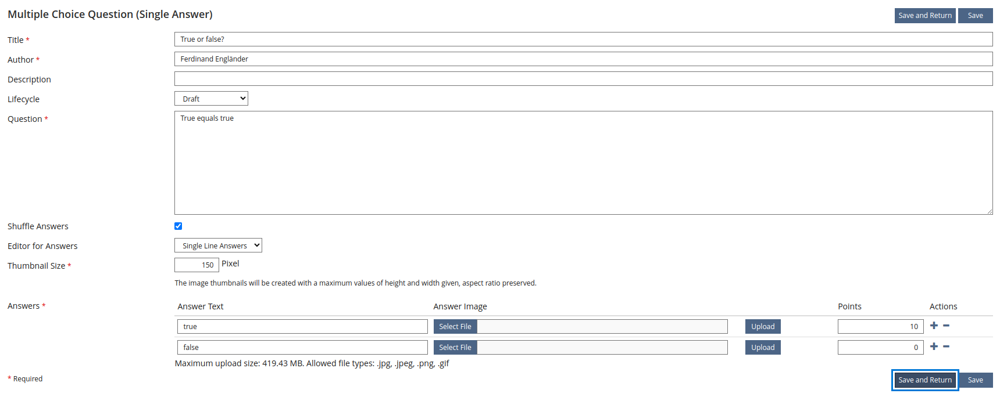
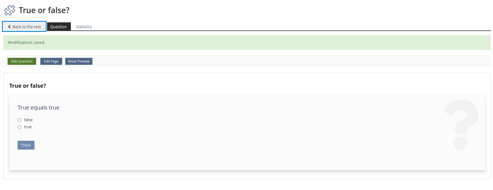
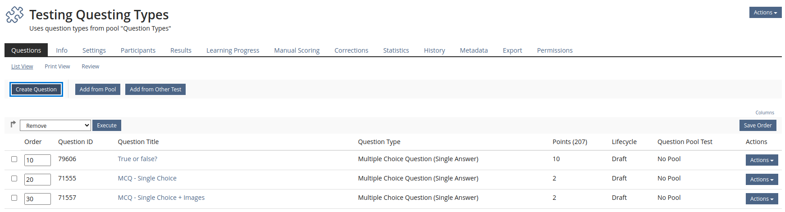
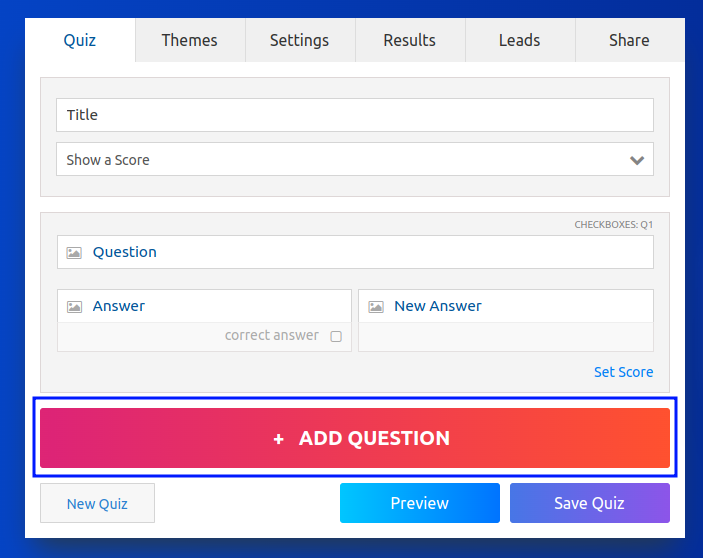
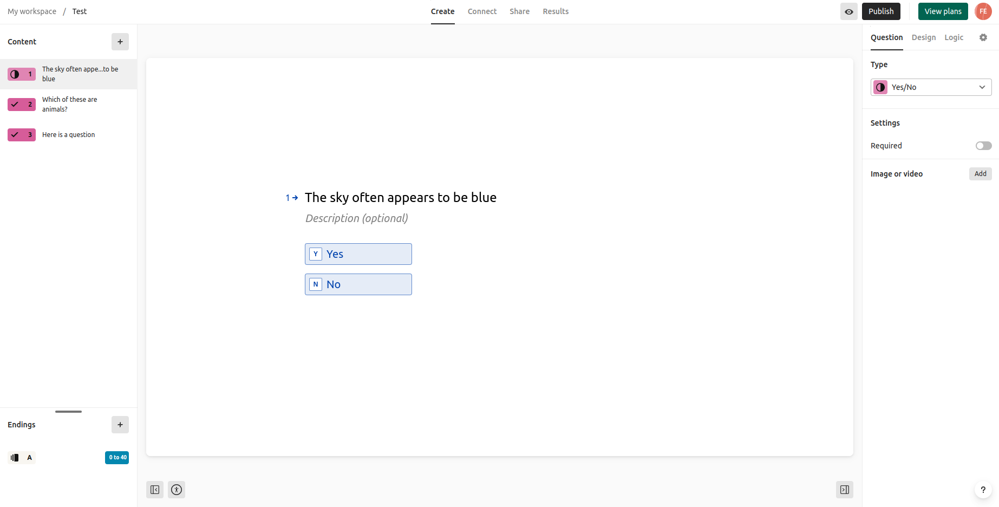
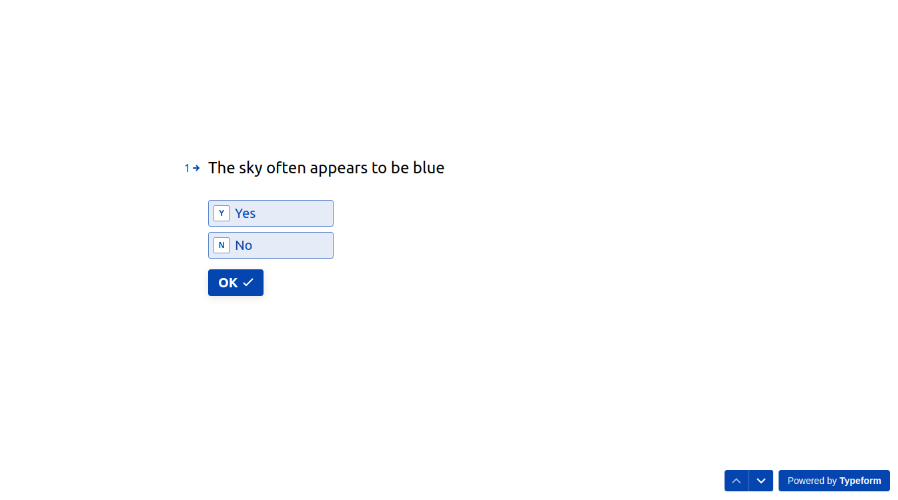

---

marp: true
theme: cate-theme
paginate: false
header: SIG EA Dortmund | cate-tms.de
footer: No ILIAS on a dead planet.

---

<!-- _class: title-01 -->

# **UI/UX Fragenerstellung**

## **Analyse**

---

## Ferdinand Engländer

Frontend Developer, Concepts and Training GmbH

---

<!-- _class: chapter-01 -->

### **Ausgangspunkt:**

## **E-Assessment Lehrende-Umfrage**

---

* Guter Einblick, wie die Fragenerstellung erlebt wird
* viel Feedback zur UI eher unscharf:
  * "nicht sehr benutzerfreundlich" (S. 22)
  * "recht kompliziert" (S.23)
  * "Editor sehr hakelig" (S. 28)
  * "zu aufwändig zu nutzen" (S.28)

---

<!-- _class: chapter-01 -->

## **Der Unzufriedenheit auf der Spur**

### Vorgang bei der Analyse

---

* messbare Kennzahlen definieren: KPI (Key Performance Indicators)
  * Klicks, Sprung in eine neue Ansicht
* hilfreiche UI/UX Prinzipien
* ergründen, warum sich das Arbeiten in anderen Quiz Builder Tools reibungsloser anfühlt
* Rückschlüsse und Empfehlungen für ILIAS

---

* Fokus: Allgemeine Verbesserungen von denen alle Fragetypen profitieren
* statt Pflaster kleben, grundsätzliche Konzepte finden

---

<!-- _class: chapter-01 -->

## **Messungen**

---

In verschiedenen Tools zur Fragenerstellung:

* Beginn bei Fragenübersicht
* Erstellung einer Single Answer True/False Frage
* Erstellung einer Multiple Answer Frage mit 4 Optionen
* Vergabe von 10 Punkten für jede korrekt gewählte Option einstellen
* Ende in der Übersicht

---

## Quiz-Maker.com vs. ILIAS

---


---

| Tool            | Click Count | Change of View | Set 10 points for correct answers  |
| --------------- | ----------- | -------------- | ---------------------------------- |
| ILIAS           | 33          | 8              | possible                           |
| Typeform        | 19          | 3              | possible                           |
| Quiz-Maker.com  | 18          | 3              | possible                           |
| EasyTestMaker   | 18          | 4              | only for overall correct/incorrect |
| H5P             | 16          | 0              | not possible                       |
| Articulate Rise | 13 - 16     | 0              | not possible                       |


---

## Klicks

* viele Klicks sind nicht zwangsweise frustrierend
* möglicherweise Symptom nerviger Kleinschrittigkeit sein

---

## Sprung in eine neue Ansicht

* Neuorientierung, die Zeit kostet
* besonders frustrierend bei der Eingabe vieler Fragen

---

<!-- _class: chapter-01 -->

## **Hilfreiche UX/UI Prinzipien**

---

## User Intent

* Was genau möchten die Nutzenden (meistens)?
* Dann zeigen wir ihnen nur genau das oder das Relevanteste größer

---

## Mental Model

* Wie kennen die Nutzenden das schon?
* Dann machen wir das so, wie sie das kennen (Bsp.: Drag and Drop)

---

## Miller's Law

* Menschen können nur ca. 7 Elemente gleichzeitig im Kurzzeitgedächtnis behalten
* Durch Gruppieren (Chunking) können Dinge als eine Einheit wahrgenommen (und gemerkt) werden
* 368120947
* 368 120 947

---

<!-- _class: chapter-01 -->

## **Weitere Beobachtungen**

---

## Eingabe, Vorschau, Übersicht

* beschreibt unterchiedliche User Intents zu unterschiedlichen Zeite
* hier gibt es Frustrationsgefahr:
  * nicht-editierbare Vorschau, wenn Nutzende eine Eingabe erwarten

---

## Flow State

Das Interface tritt zurück und die Eingabe fließt aus mir heraus.

---

Unstimmigkeit beim User Intent oder Mental Model bricht diesen Flow

Beispiel: Abschließen der Fragenerstellung

---



---



---



---

Vergleich mit Quiz-Maker



---

## Tastatur Navigation

* Leute, die dutzende Fragen eingeben, werden irgendwann die Tastatur nutzen wollen

---


---

## Eingabefelder

* können wir diese angelehnt an Miller's Law besser gruppieren?
* Sichtbarkeit von grob zu fein
  * wichtige Dinge oben
  * evtl. weitere Optionen dynamisch einblenden

---

* relativ weit oben (also wichtig?):
  * Autor
  * Lifecycle (Entwurf, Final,...)
* Platzhalter für gute Funktionen, die aber kaum benutzbar sind
  * keine Bulk Operationen
  * kein echtes Verstecken/Veröffentlichen
  * Filter fehlen in der Test Übersicht

---

und mehr Beobachtungen...

stehen im Paper: https://tinyurl.com/ilias23-creating-questions

---

<!-- _class: chapter-01 -->

## **Mögliche Ansätze**

---

## Was suchen wir?

* guter Fluss
* leicht zu verstehen
* trotzdem komplexe Möglichkeiten

---

## 1. Markdown

```markdown
1.  What is 2+3?
a)  6
b)  1
xc) 5

1.  Which of the following are dinosaurs?
[ ] Woolly mammoth
[x] Tyrannosaurus rex
[x] Triceratops
[ ] Smilodon fatalis
```

---

* extrem schnelle Eingabe
* aber dann müssen die Nutzenden Markdown lernen
* Hinweitexte und verzweigtes Feedback schwer zu kodieren
* kaputtes Markdown nach Fehlern zu durchsuchen ist nervig

---

## 2. Volles WYSIWYG

Beispiel Typeform:

---



---



---

* Vorschau = Bearbeitung
* wohin mit den komplexen Profi-Einstellungen?
* eher Fremdkörper in ILIAS
* unrealistisch teuer zu entwickeln

---

## 3. ILIAS UI Komponenten

* Problemstellen mit existierenden Mitteln ändern:
  * Slate könnte eine Fragenübersicht darstellen
  * Formulare könnten dynamischer werden
* Verwirrung Textfeld, Page Editor, TinyMCE/Markdown lösen
* besseres Tastaturverhalten
* Vorschau nicht als Unterbrechung
* mehr im Paper: https://tinyurl.com/ilias23-creating-questions

---

<!-- _class: chapter-01 -->

## **Unsere Empfehlung**

---

ILIAS UI Komponenten

* kein Bruch zum Rest des Interface
* alle Stellen in ILIAS profitieren
* statt drei Feuer zu löschen: grundsätzliches Konzept entwickeln, das alle drei Feuer abdeckt
