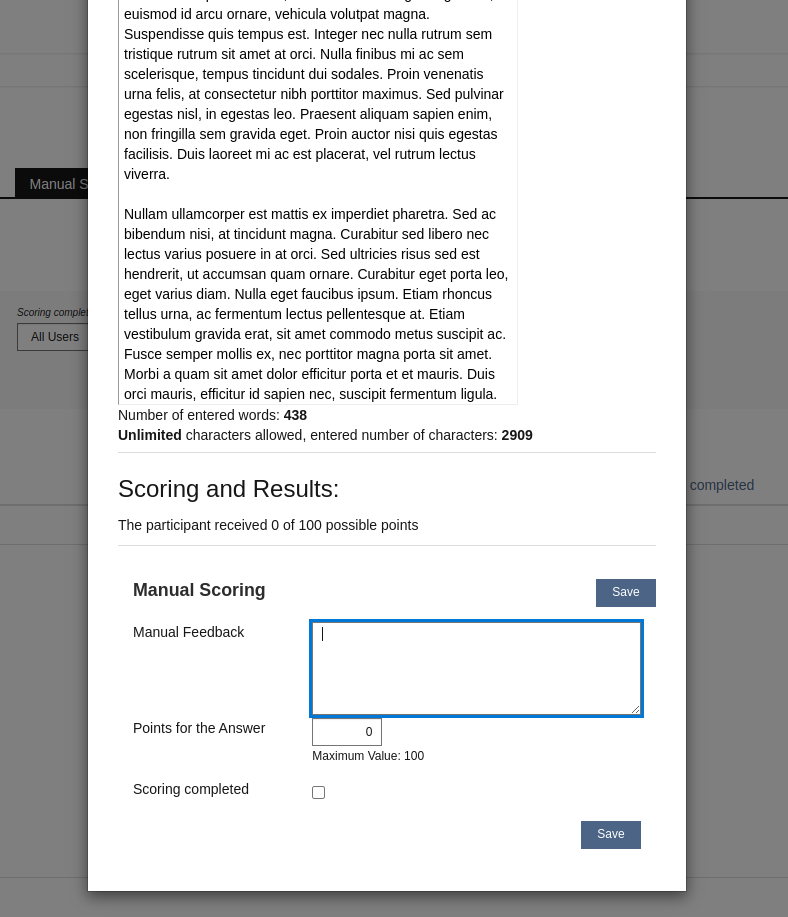

---

marp: true
theme: cate-theme
paginate: false
header: SIG EA November | cate-tms.de
footer: No ILIAS on a dead planet.

---

<!-- _class: title-01 -->

## **UX Verbesserung**

# **Manuelle Bewertung**

---

<!-- _class: chapter-01 -->

### **Ausgangspunkt**

---

Manuelle Bewertung fühlt sich umständlicher an als die Bewertung auf Papier

---

Bewertung nach Frage / nach Teilnehmenden unterscheiden sich

---

Schreiben längerer Bewertungen zu längeren Texten
* Bewertungstext und Essay können nicht gleichzeitig betrachtet werden
* Viel unnötiges Scrollen

---

<!-- _header: "" -->
<!-- _footer: "" -->

---

Modal
* Klick zum Öffnen
* Falscher Klick könnte es versehentlich schließen

---

<!-- _class: chapter-01 -->

### **Zielsetzung**

---

* Wie zuvor: Manuelles Bewerten ermöglichen
* Klicks reduzieren
* Bewertungstext und Antwort nebeneinander im Blick
* Geschwindigkeit, Flow erhöhen

---

<!-- _header: "" -->
<!-- _footer: "" -->

---

## Was bringt uns das?

* Spürbare Verbesserung für bestehende Nutzungsszenarien
* Nutzungsszenario "Manuelle Bewertung" wird interessanter für weitere Institutionen
* Teilnehmende spüren eine schnellere Benotung (und entspanntere Prüfende)

---

## Beteiligung

* Ferdinand Engländer, CaT Concepts & Training
  * Richard Klees, Nils Haagen
* Marko Glaubitz, Universität Freiburg
* Denis Strassner, Universität Hohenheim

---

<!-- _class: chapter-01 -->

### **Herausforderungen**

---

* 3 Dimensionen: Teilnehmende, Frage/Antwort, Test Durchlauf
* Zwei Herangehensweisen für die Bewertung
  * nach Teilnehmenden - alle Antworten eines Teilnehmenden
  * nach Frage - die Antworten aller Teilnehmenden zu einer Frage
* T&A Code ist an vielen Stellen schon älter
* moderne UI Components reichen für eine radikale Umgestaltung noch nicht aus
* insbesondere die Fragen/Antworten/Feedback selbst fehlen als UI Components
* bisher kaum asynchrones Laden/Speichern/Aktualisieren in ILIAS

---

<!-- _class: chapter-01 -->

### **Machbare erste Version**

---

Was geht (noch) nicht?

* asynchrones Laden/Speichern/Filtern
* spezielles Fragen/Layout UI Components

---

Modal

* Ablösen durch sequentielles Durchgehen
  * wie der Test selbst
  * wie Korrigieren auf Papier

---

kein (Kiosk-)Modus

* Neuorientierung vermeiden, Kontext erhalten
* Noch sind keine Spezialwerkzeuge in Aussicht, die erhöhten Fokus benötigen
  * z.B. zwei Essays vergleichen, Inline- oder Randkorrekturen

---

Sequence Navigator

* Entwicklung läuft bereits
* notwendig für andere Bereiche (Learning Sequence, Test Player)

---

---

Sticky Elemente, wo es Sinn ergibt

---

= alles kleine, aber wirkungsvolle Schritte zu einem flüssigeren Arbeiten

---

<!-- _class: chapter-01 -->

### **Zukunftsmusik**

---

Ein paar [Mockups](https://design.penpot.app/#/view/5e250d03-b345-8112-8005-28260c3fdccd?page-id=5e250d03-b345-8112-8005-28260c3fdcce&section=interactions&index=0)

---

* Edit/View Mode für Bewertung
* asynchrones Speichern/Laden/Filtern
* Echtzeit Rückmeldung (z.B. aktuelle Durchschnittspunktzahl)
* inline Durchlauf Umschalter
* Nutzung der Slate?

---

<!-- _class: chapter-01 -->

### **Macht mit!**

---

* Was muss noch beachtet werden?
* Rückmeldungen eurer Nutzenden?
* Finanzierung und Entwicklungsstunden bringen uns alle weiter!
