---

theme: cate-theme
paginate: false
header: ILIAS Conference 2024 | cate-tms.de
footer: No ILIAS on a dead planet.

---

<!-- _class: title-01 -->

## **A toolset for**
# **Building Helpful Pages in ILIAS Together**

---

<!-- _class: chapter-01 -->

## **Let's start with a game...**

---

how do we want a new user to start

* start page instead of dashboard

---

<!-- _footer: "" -->
<!-- _header: "" -->

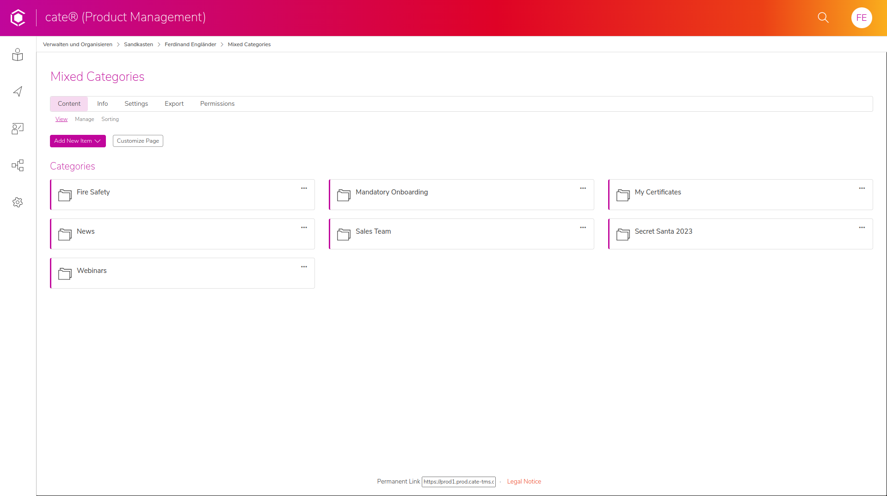

---

<!-- _footer: "" -->
<!-- _header: "" -->

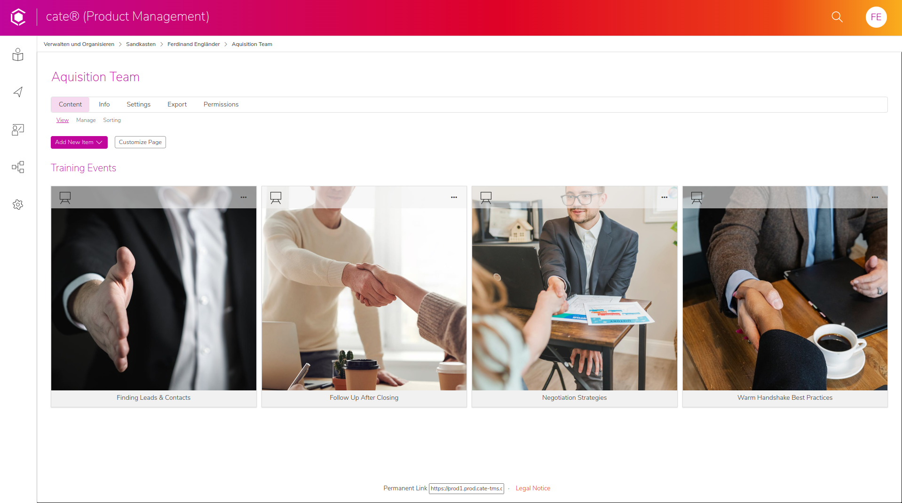

---

Strategies and best practices can prevent pages like this.

Let's rewind...

---

<!-- _class: chapter-01 -->

## **A fresh start is wonderful**

---

I ❤️ a brand-new

* computer
* paper planner
* renovated home

---

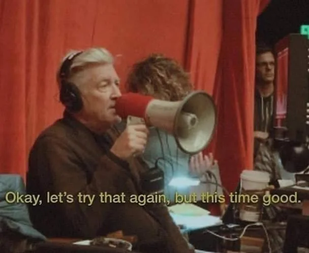

A new chance, when everything

* can still be the way I want it to be
* is not yet overwhelming
* the everyday chaos has not yet taken over

---

## But how does it end...

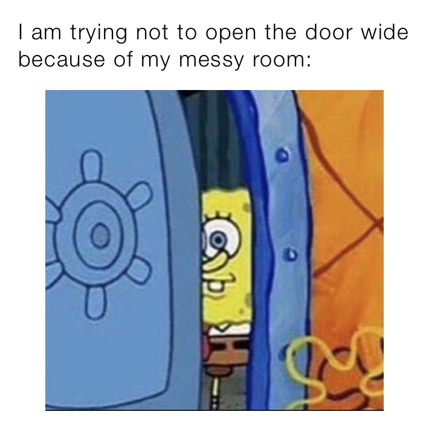

---

One day a renovated home will...

* be a bit messy
* need compromises with the other people living there
* have boxes in the basement where no one is sure how they got there, but what if we need that old DVD player to watch a DVD and the ice cream maker and the surf board, so we really can't throw these away.

---

This could happen to an ILIAS installation

* from clear to overwhelming
* from pretty to ugly
* from expertly managed to everyone doing their own thing

---

<!-- _class: chapter-01 -->

## **How can we keep things from getting messy?**

---

<!-- _class: chapter-01 -->

## **We have seen systems go messy and back**

---

* Ferdinand Engländer - frontend-developer
* CaT Concepts and Training GmbH
* we run ILIAS instances modified and specialized for businesses
* insurances, car manufacturers, mid-size to large organizations,...

---

<!-- _class: chapter-01 -->

### **Coming to terms with**
## **uncomfortable truths**

---

With regards to all users 

* **most users use ILIAS because they have to, not because they like it**
* possible misunderstanding: they manage to use it = everything is fine
* how can we make it a system that everyone likes to use
  * initially
  * long term

---

With regards to managing users

* **the freedom in ILIAS can be a curse**
* many ways to paint yourself into a corner
* different creators might have completely different ideas of how to use the system

---

<!-- _class: chapter-01 -->

## **Let's make an effective ILIAS together**

---

* Making decisions based on use cases
* Pitfalls of unclear structure
* Using the Page Editor effectively together
  * Helpful (not just appealing) design
  * Content Style Blocks
  * Templates
  * Communicating strategies
* Breaking the limits
  * Styling blocks through the system style
  * cate trainings search

---

<!-- _class: chapter-01 -->

## **Making decisions based on use cases**

---

Who wants/needs to create ILIAS content?
* groups (IT, product development, knowledge management)
* individuals (leaders, trainers, experts)
* What's their familiarity with ILIAS?

---

What is the target group size?
* general (widespread)
* very specific (to whom it may concern)

---

What update and teaching cycles do exist for which group?
* on rare occasion
* on frequent occasion
* yearly
* monthly
* weekly

---

Where is the motivation/pressure coming from?
* mandatory (regulations & laws, IDD time)
* core business (processes, operations)
* nice to have (personal development)

---

How much time and money can we spent on a page or piece of content - depends on
* target group size
* update and teaching frequency
* measurable gain - payback of the investment
  * complying with regulations
  * boost productivity
  * team building
  * filling positions
  * employee happiness

---

What teaching styles/methods are most likely being used for which content?
* mandatory, yearly update, seen by many, avoids costly mistakes
  * = videos, interactive content/quiz, SCORM course from external media company
* expert gives impulse lecture, seen by few, knowledge might benefit some
  * = webinar, recorded presentation

---

<!-- _class: dont-fade-bullet-points -->

## <i class="fa fa-edit"></i> Your turn

* identify your content authors and their goals
* think about your own ILIAS instances or take a fictional example
  * car dealer & repair workshop, restaurant chain, death star, beehive

---

<!-- _footer: "" -->
<!-- _header: "" -->

<small>

| Content Author   | Target Group Size | Measurable Gain            | Update Cycle          | Teaching Cycle | Typical Format/Style   | ILIAS skills of Author |
|------------------|-------------------|----------------------------|-----------------------|----------------|------------------------|------------------------|
| team leader      | all               | complying with regulations | once                  | <--            | webinar                | none                   |
| IT               | team              | boost productivity         | on rare occasion      |                | on location training   | regular author         |
| product team     | some              | team building              | on frequent occasions |                | premium quality course | admin                  |
| external trainer | few               | filling positions          | regularly yearly      |                | interactive quiz       | ...                    |
| ...              | leader            | employee happiness         | regularly monthly     |                | recorded presentation  |                        |

</small>

---

<!-- _class: chapter-01 -->

## **Structure**

---

* a clear structure is a non-verbal instruction
* can combat decent into chaos
* sometimes a click path is quicker than a search

---

Some possible structures
* by year
* by topics
* by type (live webinar, SCORM course, in person, recordings)
* by target group
* by action (learn, teach, change settings)...

---

By year

* e.g. 2021 / 2022 / 2023 > 01 January
* at some point needs a sub-structure
* doesn't indicate much about the content (was X a client/product in 2022)
* very helpful where up-to-date content is vital (recent regulations, yearly line of products)

---

By topics

* e.g. Product Development / Lead Generation / Product Line > Consumer Models, Industry Models
* very human-friendly
* too many or ambiguous topics can cause confusion
* what is sub-topic parent-topic? e.g. electronics > handbooks
* some topics might be relevant to many, others relevant to a few
  * alphabetical sort might not be the best

---

By type

* webinars / live on-location / online courses / interactive training / handbooks
* doesn't reveal anything about the topics inside
* okay as secondary structure
  * type can be indicator of time/attention investment

---

By target audience

* sales team / product developer / floor worker / manager
* very friendly for human navigation ("I am X")
* smallest segment might still need further segmentation
* some content overlaps (product info, fire safety)
* bridges well to topics

---

By action

* stay up to date / learn / teach / organize / administrate
* actions can be a good first level menu
* cover target groups that overlap broadly (all team leaders need to teach)

---

<!-- _class: dont-fade-bullet-points -->

## <i class="fa fa-edit"></i> Your turn

* What structure of categories do we use where and to which point?
  * by topics, by type, by target audience, by action...

---

<!-- _class: chapter-01 -->

## **Repository Pages without the Page Editor**

---

Category "Onboarding"

---

<!-- _footer: "" -->
<!-- _header: "" -->

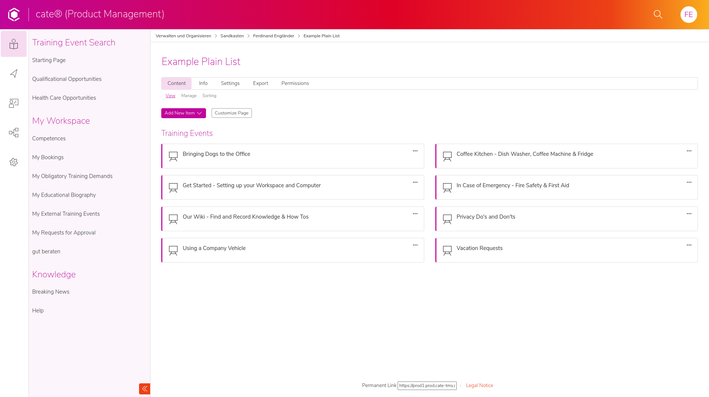

---

<!-- _footer: "" -->
<!-- _header: "" -->

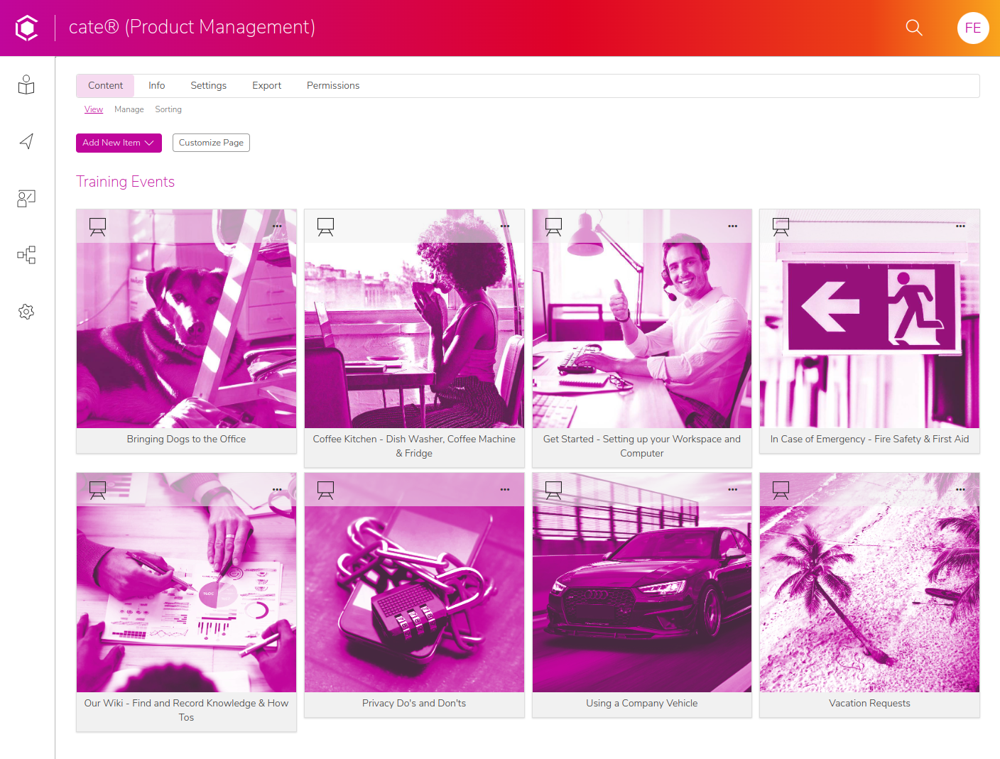

---

* List of items (e.g. categories) has no weighting
* Even cards have no weighting

---

<!-- _class: chapter-01 -->

## **Using the page editor to build overviews**

---

<!-- _footer: "" -->
<!-- _header: "" -->

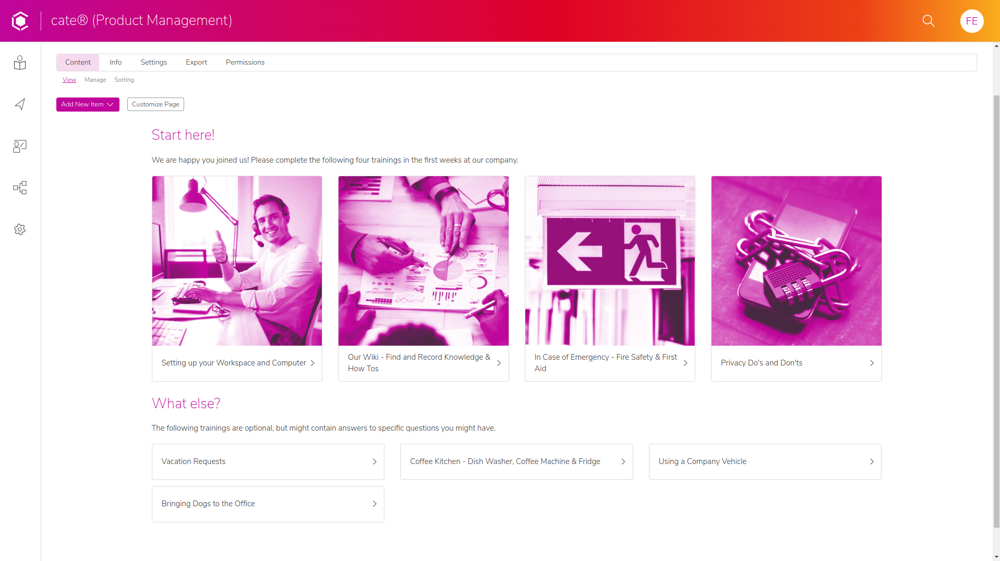

---

## Page Editor Sections/Blocks vs Repository Items

---

Repository Items

* Lists of repository objects are always up to date
* Limited control over design
* only two visual weights (card and item)

---

Custom Page Editor Sections/Blocks

* Many different designs and visual weights possible
* some temporary and helper objects can be better omitted/hidden
* copying and updating fake card items can be time-consuming and error-prone

---

## Multiple sections

---

Sections build around questions

see [University of Bern Support page](https://ilias.unibe.ch/ilias.php?baseClass=ilwikihandlergui&cmdNode=18e:sm&cmdClass=ilobjwikigui&cmd=viewPage&ref_id=2572718&page=Landing_page)

---

Structures can change per section
* Announcement by date
* Sales Team / Factory Staff / Management
* My Progress & Certificates / My Bookmarks / My Settings

---

Sections can have a call to action
e.g. for onboarding page
* book in person training
* mandatory trainings
* optional trainings
* Say "hello" in the company Slack
* Contact if you have questions

---

Design = Structure
* create hierarchy
  * not by what looks good, but by information priority
* build familiar patterns, people can recognize (see next page)
* some branding and visual coherence, not everyone doing their own thing

---

---

<!-- _class: dont-fade-bullet-points -->

## <i class="fa fa-edit"></i> Your turn

* Which places in your (fictional) ILIAS benefit from featured/multiple sections?
* What purpose does each section have?

---

<!-- _class: chapter-01 -->

## **Building blocks of pages**

---

## Sections

* ILIAS comes with a default set of content styles
* you can add your own
* (text blocks and character styles)

---

(show content styles in ILIAS 9)

---

### Default blocks have mixed semantics

---

<!-- _header: "" -->
<!-- _footer: "" -->

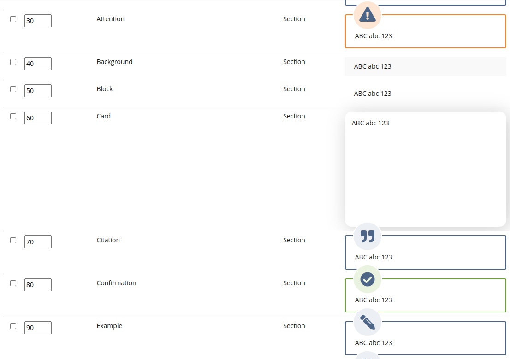

---

### Naming Convention: Purpose

* e.g. Example, Citation, Important
* Encodes instructions into the section's name
* Using Citation for an important alert is objectively wrong
* might lead to visual duplicates: course card = news card

---

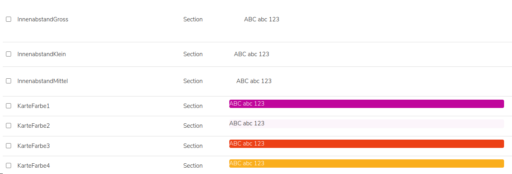

---

### Naming Convention: Appearance

* e.g. bright-card, dark-card
* needs communication and template pages that explain usage
* might invite more experimentation and combinations than you might want to support (dark-card in bright-card in center-align-text)
* recommendation: needs dedicated team and experts to maintain and teach

---

## Appearance with purpose hints

* University of Bern
* loud vs. quiet

---

## Nested Appearance Sections

---

<!-- _header: "" -->
<!-- _footer: "" -->

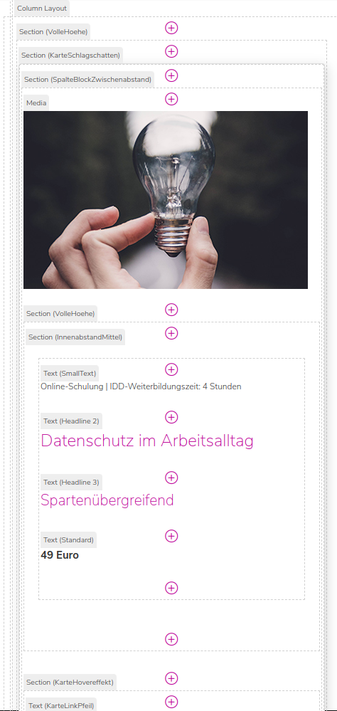
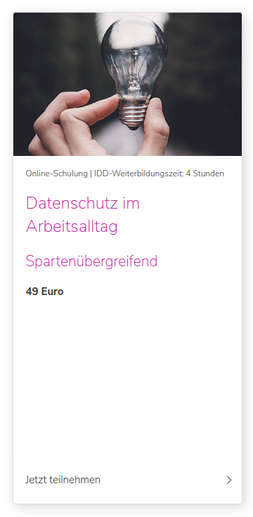

---

Pro
* with nested constructs almost anything becomes possible
* with just a few different sections you can build very different pages/elements

---

(show [card page](https://prod1.prod.cate-tms.de/ilias.php?ref_id=1068&cmd=return&cmdClass=ilrepositorygui&cmdNode=16u&baseClass=ilRepositoryGUI&redirectSource=ilcontainerpagegui&cmdMode=) in cate)

---

Con
* high CSS skill level needed
* quickly become too complex to build by hand, needs templates to copy from
* rivals Section > Block > Character / (Outer) Section > (Inner) Section > (Helper Style) Section 

---

## Templates

many single elements
best practices at the top
see [card page](https://prod1.prod.cate-tms.de/ilias.php?ref_id=1068&cmd=return&cmdClass=ilrepositorygui&cmdNode=16u&baseClass=ilRepositoryGUI&redirectSource=ilcontainerpagegui&cmdMode=)

---

whole template page
new image size indicators
see [start page](https://prod1.prod.cate-tms.de/ilias.php?ref_id=2723&cmd=render&cmdClass=ilrepositorygui&cmdNode=16u&baseClass=ilrepositorygui)

---

<!-- _class: dont-fade-bullet-points -->

## <i class="fa fa-edit"></i> Your turn

* which one of your section could use what kind of design element?
  * card
  * sidebar
  * news section
  * icon & text
  * icon & list
  * ...
* rough mockups can help to visualize ideas

---

## Using ILIAS to teach and interact with your creators

* handbook pages
* courses (maybe with screen captures videos)
* webinar and live demos, workshops training
* feedback

---

## Beware

Hard lessons we had to learn

---

wishing for too many styles
* too many styles can become overwhelming
* a large style library is difficult to maintain
* too many design elements = loss of visual coherence

---

don't build a website
* websites usually don't have that many content creators with vastly different skill levels
* the complexity of most modern website design's goes beyond what you can maintain and teach
  * inner-spacing-large or inner-spacing-small?
* keep it simple

---

the page editor isn't Microsoft Word
* should people be able to randomly style text green?
* limitations
  * can force people to make good design decisions
  * create visual coherence

---

<!-- _class: chapter-01 -->

## **Advanced Techniques**

---

### System style can style content styles

(demo targeting a class)

---

Pro
* very complex nested styling possible
* easier to roll out and adapt for many different skins

Con
* needs good CSS and page editor knowledge
* conflicts with many custom style functions in ILIAS (e.g. per page custom style)
* not an officially supported feature

---

### Multi-style

(demo in cate, making card with drop shadow)

---

### Maybe in the future: Page Editor Plugin

One block = one complex element, no nesting

---

<!-- _class: chapter-01 -->

## **Conclusion**

---

* design is structure, not decoration
* building your own pages provides guidance
  * for users: visual weighting / segmentation
  * for creators: toolkit, templates for quick & consistent pages
* clear use cases provide focus
* templates can be their own documentation

---

Curious what else cate can do?

Creating mandatory training for business clients:
https://cate-tms.de/cate-erklaert.html

