---

marp: true
theme: cate-theme
paginate: false
header: ILIAS DevConf March 2024 | cate-tms.de
footer: No ILIAS on a dead planet.

---

<!-- _class: title-01 -->

# **The perfect form**

## **Optimizing forms with many fields**

---

<!-- _class: chapter-01 -->

## **No app without forms**

---

### Data input needs forms

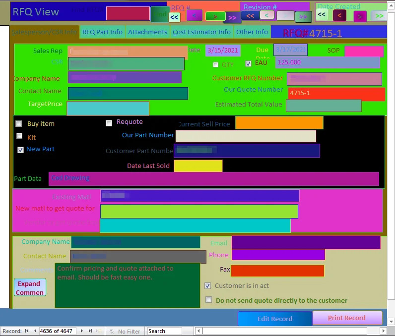

<small>source: [r/BadUIBattles, user: Ferro Giconi](https://www.reddit.com/r/badUIbattles/comments/m7y6qw/the_theme_i_created_for_the_access_database_at_my/)</small>

---

### Conventions and expectations

You realize how many you know, when you see them broken.

https://userinyerface.com/

---

## Mental Modal

"I know how this should work from somewhere else."

<video autoplay muted loop width="500px"><source src="img/r-baduibattles_hakimel_clickmeifyoucan.mp4" type="video/mp4"></video>

<small>source: [r/BadUIBattles, user: hakimel](https://www.reddit.com/r/badUIbattles/comments/13fe8fg/working_on_my_new_unsubscribe_page/)</small>

---

### Helpful

* it's like a language we share with the user
* if we speak their language, the users feel at home

---

### Challenge

* like a language it can be used incorrectly
* sometimes creating something good requires multiple drafts
* misunderstandings happen

---

<!-- _class: chapter-01 -->

## **The perfect form?**

---

## It depends...

* like with language: no one answer to write the perfect poem, essay or paper
* Does it do, what it is supposed to do?

---

## There is more than one way

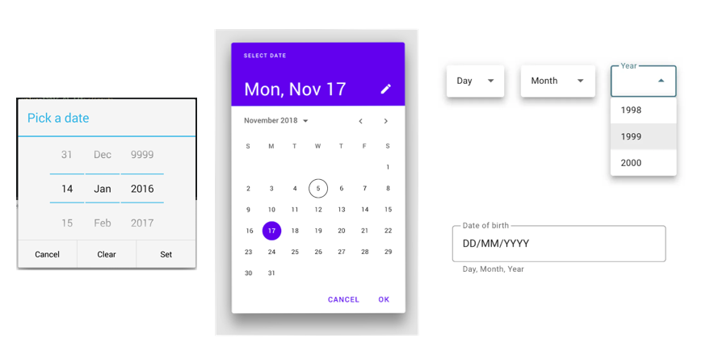

---

## Which one is the best in *this* case?

---

<!-- _class: chapter-01 -->

### **Actual title for this presentation:**
## **Best practices for forms potentially interesting for ILIAS**

---

# Let's talk about

* Evidence-based design choices
* The goal of a form
* Forms in ILIAS
* What to avoid & what to consider?
* Possible next steps for ILIAS forms

---

# Ferdinand Engländer

* Frontend Developer at Concepts and Training GmbH
* many ILIAS UI Component projects together with the University of Bern
* past UI research and projects for the University of Bern
* this presentation is also based on a research paper commissioned by the University of Bern

---

<!-- _class: chapter-01 -->

## **Evidence-based design choices**

---

# Problem with Design

If it's about beauty, it's up to feelings and preferences.

---

# UI is not about beauty!

It's about if users can use the interface
* quick
* no errors
* achieving their goal
* = Good UI/UX is measurable!

---

# Studies & user testing

* eye-tracking (path & fixations)
* number of errors
* time
* checkpoints / success rate
* reported issues

---

# Helpful Sources

* Luke Wroblewski, Web Form Design - Filling in the Blanks, 2008, New York, Rosenfeld Media
  * Etre Ltd User Study
* UX Research Groups
  * Nielsen Norman Group
  * Baymard Institute

---

<!-- _class: chapter-01 -->

## **The goal of a form**

---

## 3 types of form interaction

---

### 1. Condensed information prompt

---

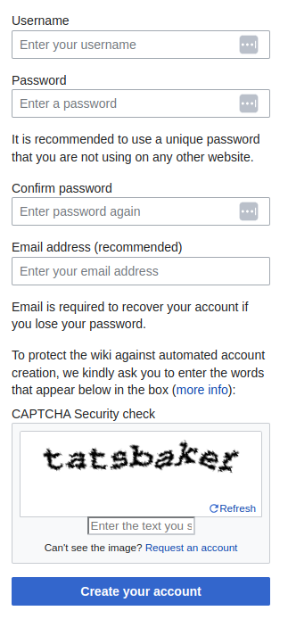

---

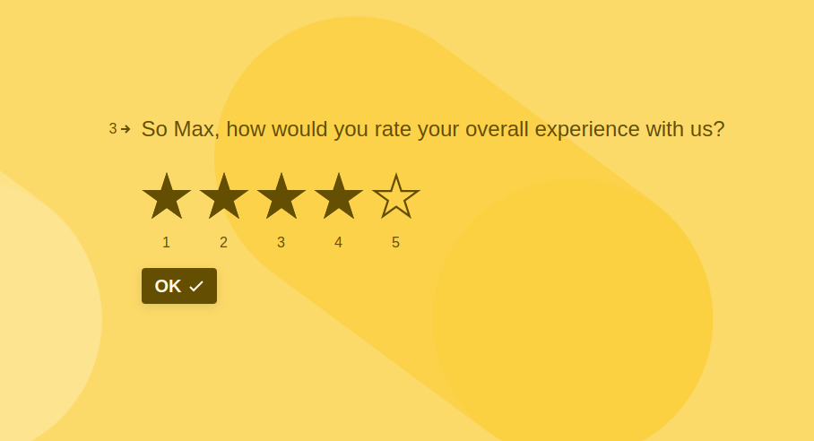

---

### 2. Object creation focus

---

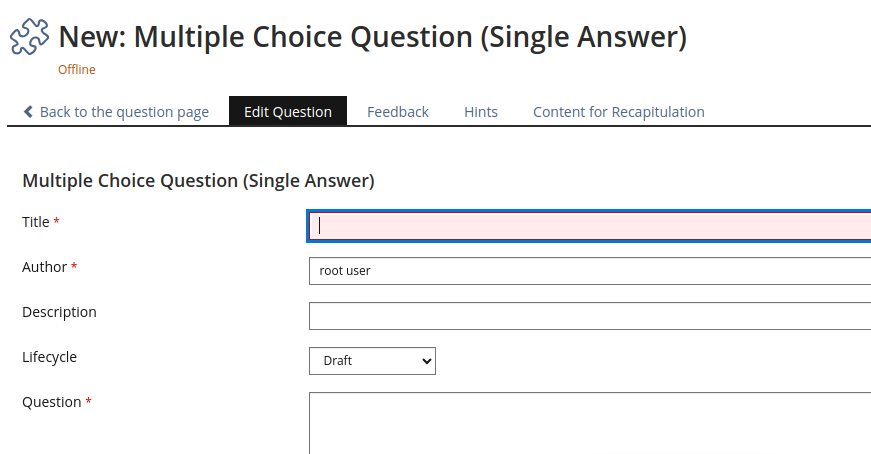

---

### 3. Adjusting Settings

---

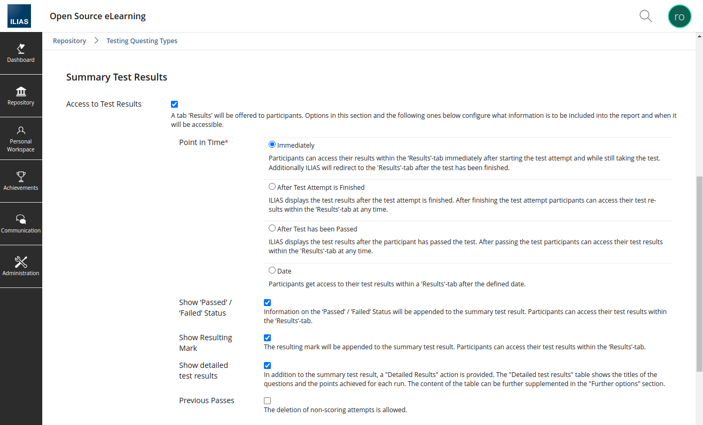

---

<!-- _class: chapter-01 -->

## **Forms in ILIAS**

---

* very often complete representation of an object
  * list of almost all possible options and properties
* design doesn't change for any interaction type
* fields are spread out over tabs and sub-tabs
* **complex objects have very long forms**

---

### Research paper objective

* How do we better deal with...
  * less relevant sections vs. mandatory sections
  * rarely relevant advanced sections
  * complex steps and nested sub-forms

---

* Goals
  * objectively 
    * shorter completion time
    * rules for structure & nesting
  * subjectively 
    * better overview
    * less frustration

---

<!-- _class: chapter-01 -->

## **What to avoid or consider?**

### **according to research findings**

---

## Accordions

---

* We have groups in ILIAS forms
* But they are not collapsible

---

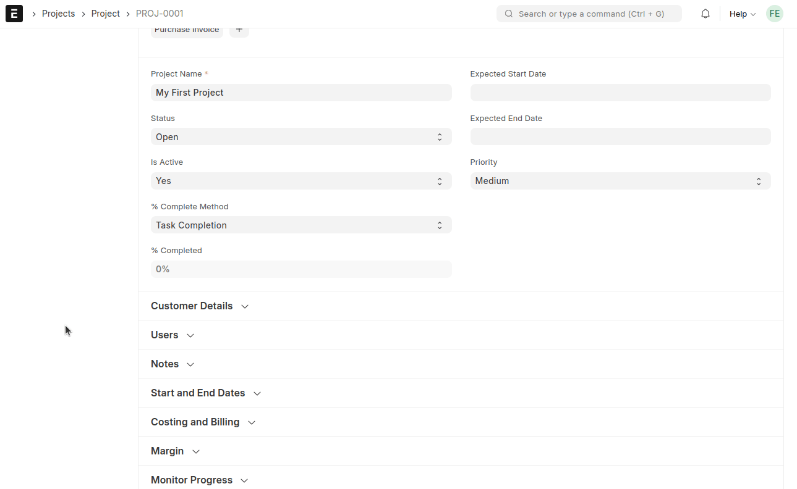

---

### Advantages

* potentially really effective: hiding irrelevant form controls until needed
* easy on the eyes
* Allowing multiple open sheets suggests that all sheets will be submitted (Tabs do not have this)

---

### Disadvantages

* can confuse users
  * which form fields will be submitted? 
* pushes rest of the page

---

### Powerful use: Step by step

* test subjects experienced accordion checkouts as a multi-step process
* returning to previous accordion section when using the browser back button
* storing data during each step
* continue button inside each accordion drawer possible
* partial validation of the input

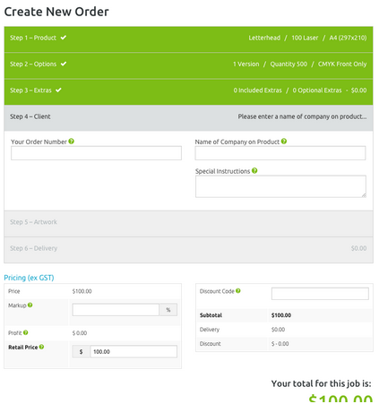

---

## Tabs

---

Inline Groups

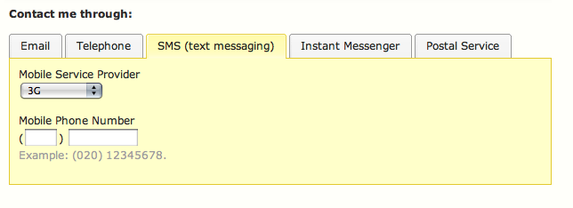

<small>source: Luke Wroblewski, Web Form Design - Filling in the Blanks</small>

---

Groups / Sub-Forms

---

### Advantages

* selected set and other available sets are clearly visible
* good when users don't need to see content from multiple tabs simultaneously
* hiding irrelevant form controls from people until they need them

---

### Disadvantages

* users often can’t tell if the “sheets” are mutually exclusive

---

### Specific to horizontal tabs

* sometimes options are overlooked
* breaks the flow in a mostly top to bottom focus
* eye-tracking data indicated that other designs were easier to process

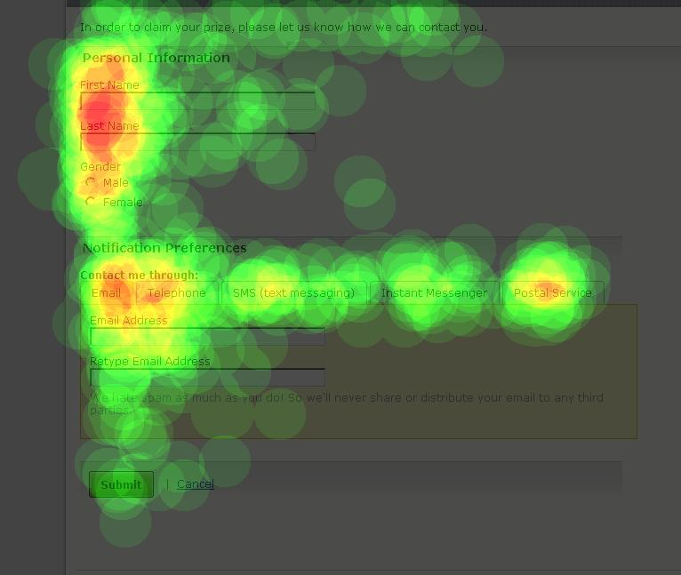

---

### Specific to vertical tabs

* mutually exclusive options can be indicated with radio buttons
* vertical tabs score better on satisfaction, eye-tracking metrics, and time to completion

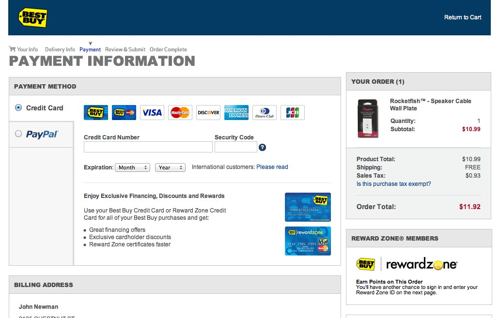

---

## Conditional Visibility

---

### Switchable / Optional Group

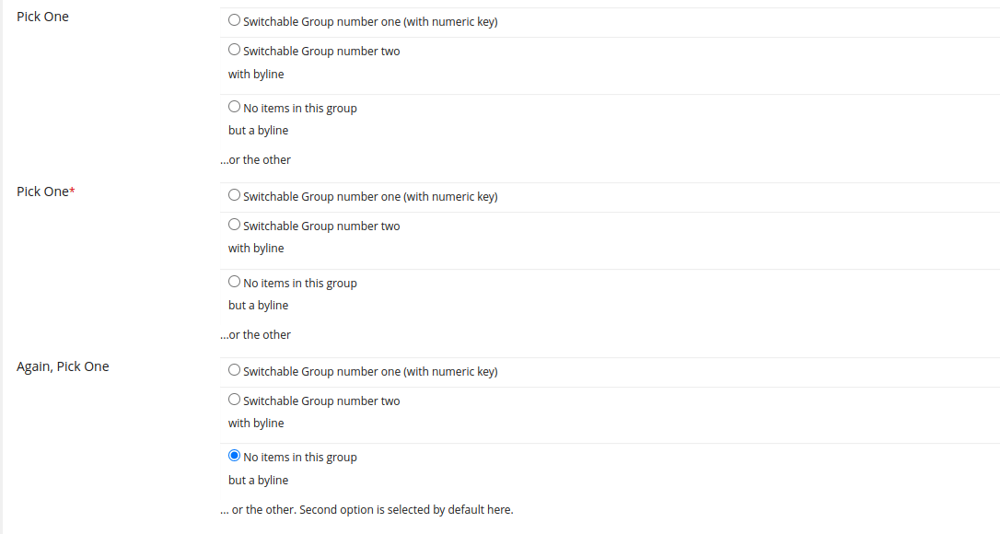

---

#### Advantages

* feature already exists in ILIAS
* maintain context of initial selection, while introducing more inputs when needed
* near perfect satisfaction ratings

---

#### Disadvantages

* animation recommended to make the page shift less jarring
* can be disorienting

---

## Wizards

---

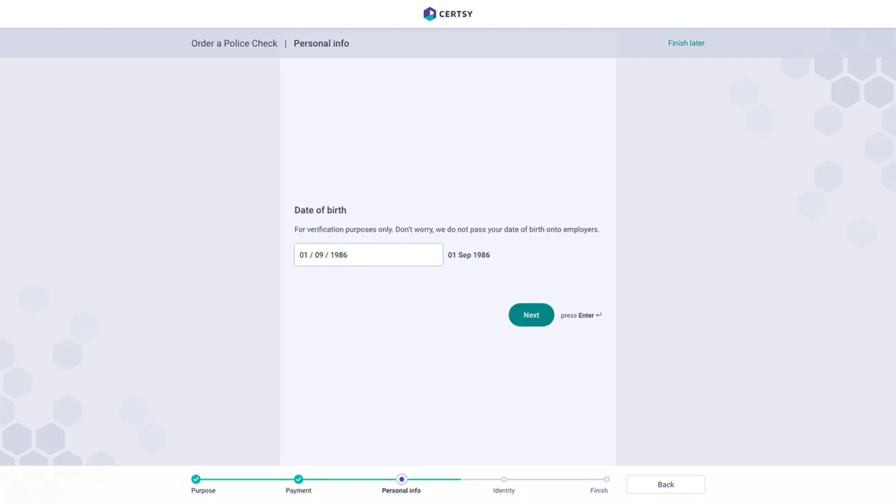

---

* specialized for new object creation
* hides optional & advanced sections by skipping over them
* average satisfaction, low number of errors, good eye-tracking scores
* lack of scroll perfect for mobile
* user might not be aware of all pages and fields
* honroable mention: chatbot / conversational forms

---

## Editing & Viewing Mode

---

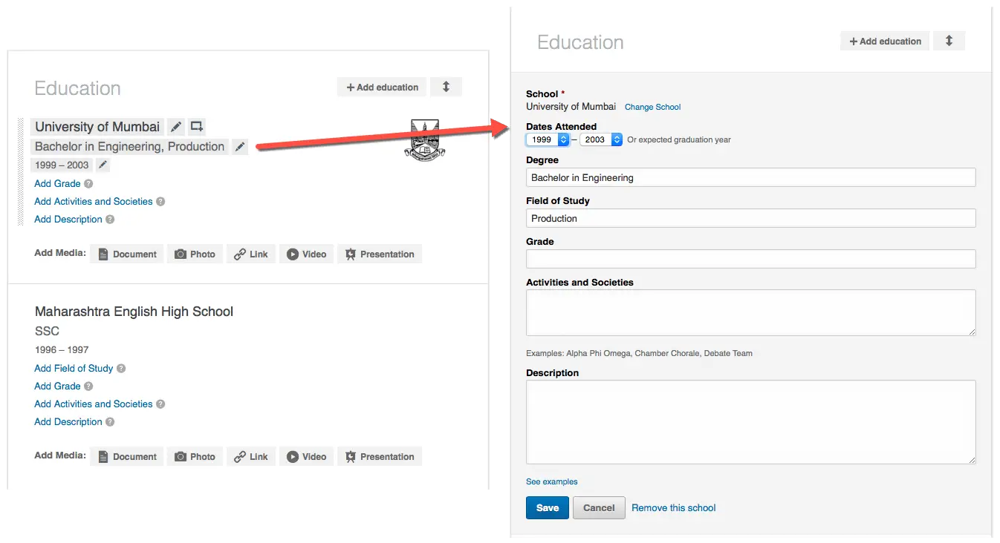

---

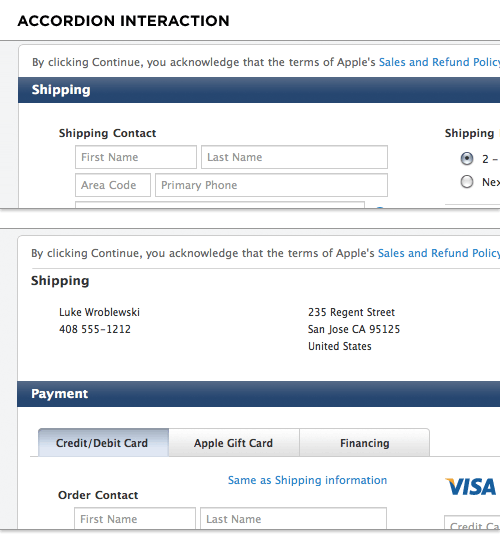

---

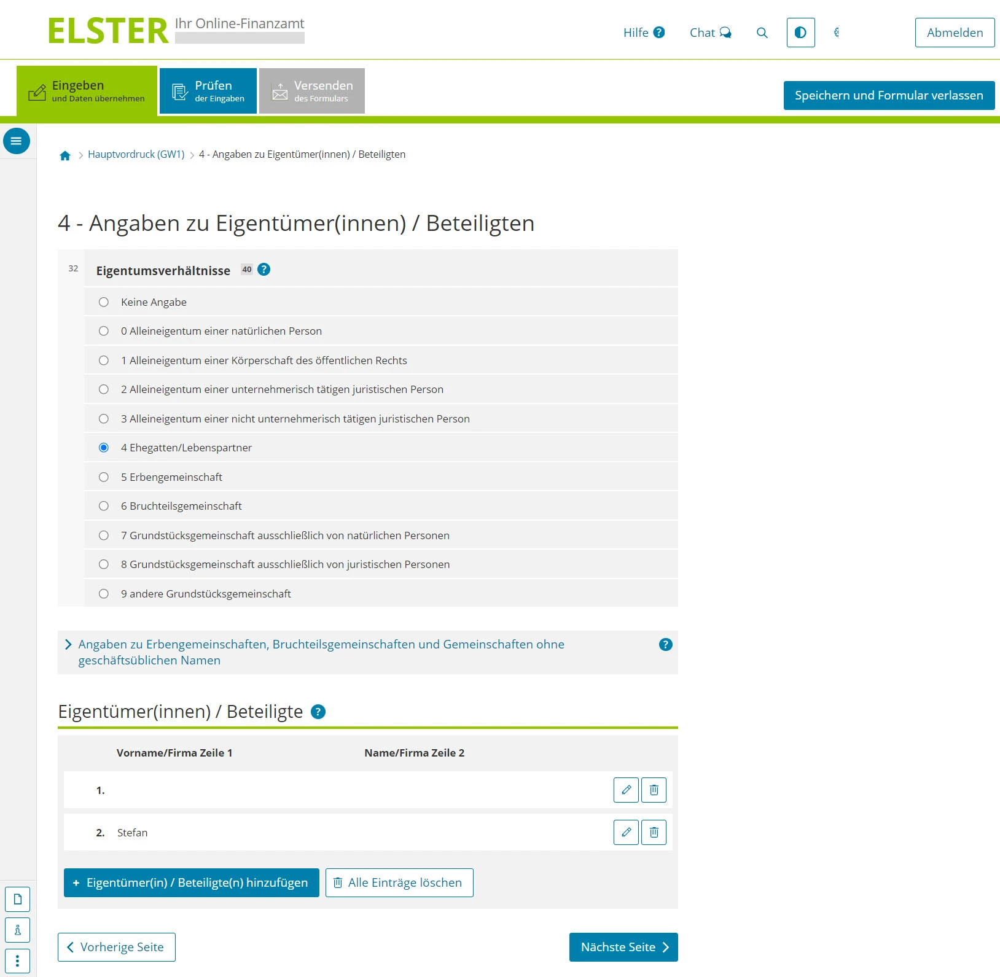

---

### Advantages

* solves the issue with vertical accordions because there is no doubt that the data has been saved.
* the view mode summary could omit labels where they are clearly implied ("first name: Bob, last name: Smith" simply becomes "Bob Smith")
* can hide empty or advanced inputs entirely

---

### Disadvantages

* The need to switch to an edit mode can potentially introduce an unnecessary obstacle (what can be edited?)

---

## Object-Oriented Branching

using summary view sections

---

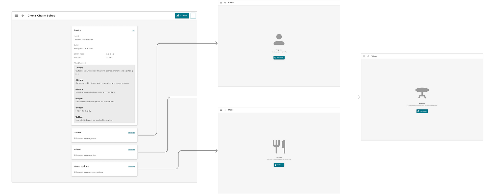

---

less sub-tabs more child-items

---

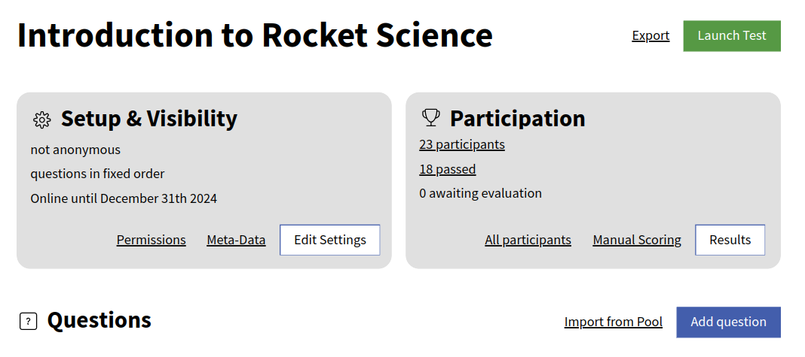

---

* strong focus on the process and a structure of sub-views and -items

---

### Advantages

* object oriented structures align with the user's mental model to focus on one object at a time
* clear drilldown-style way-finding
* exposing selected information from lower layers in view mode increases the overview and saves clicks
* Breaking large and complex forms into smaller and simpler forms is a fundamental principle in creating mobile-friendly designs

---

### Disadvantages

* goes far beyond just tweaking the current forms: A lot of concept work and user testing is required
* Some people might prefer an "everything" screen

---

## Modals

---

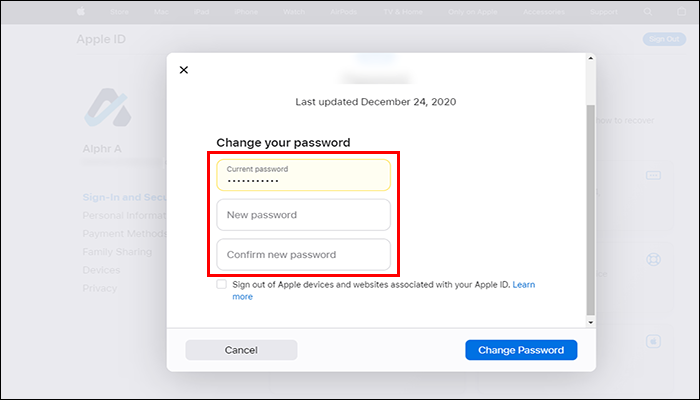

---

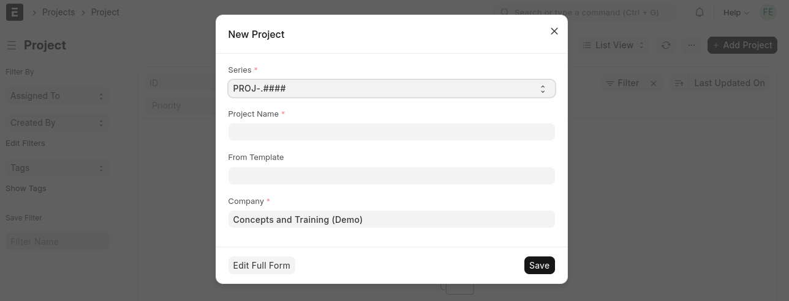

---

### Advantages

* great for a large number of initially hidden inputs
* avoids page jumping and disorientation

---

### Disadvantages

* modal should not cover up anything the user might still want to reference - sidebars and accordions might do a better job
* if context is lost it's "hard for users to know where they are and what’s going on, especially those with cognitive disabilities"
* how the modal closes or saves needs to be made very clear to avoid frustrations

---

<!-- _class: chapter-01 -->

## **Possible Next Steps for ILIAS**

---

## Working with what we have

* switchable / optional groups
* reducing fields
* re-ordering fields by priority and expected relevance
* grouping fields by semantic groups
* can be done now without waiting for any features
* user testing (thinking out loud method)

---

## Separating Creation and Viewing?

* sometimes you just want to see an overview and not edit much
* sometimes you want to create and go through all settings

---

## New form types?

* Wizard
* Quick-Entry
* Administrative form
* Editable Summary Section
* ...what would be feasible without the UI framework exploding?

---

## Configuring field visibility

* maybe choices during ILIAS installation
  * Test & Assessment light - only fields for simple pop quizzes
  * Test & Assessment exam-ready - all the fields

---

## Let's get started

* take a form and test if it would benefit from
  * hiding data in different ways (accordions, switchable groups, modals, sub-forms/-pages etc.)
  * introducing editable summary sections
  * a wizard or quick entry modal creation
* mockups and click-dummies can help judge if implementation is worth it

---

## Takeaways

* We don't have to guess: Researchg & User Testing
* 3 Interaction Modes: Condensed prompt, Creation, Adjusting 
* Some ways to improve forms are already available

---

Paper: [tinyurl.com/ilias24-form-pr](https://tinyurl.com/ilias24-form-pr)
This presentation: [tinyurl.com/ilias-24-form-pres](https://tinyurl.com/ilias-24-form-pres)

## Questions?

Ask now!

And/or come to the UI Clinic on [docu.ilias.de](https://docu.ilias.de/)