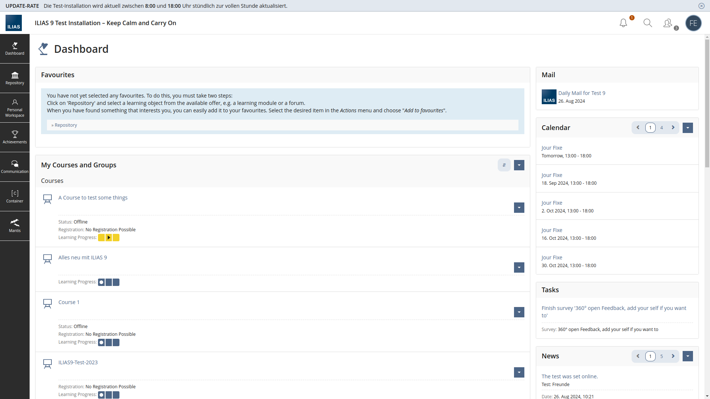
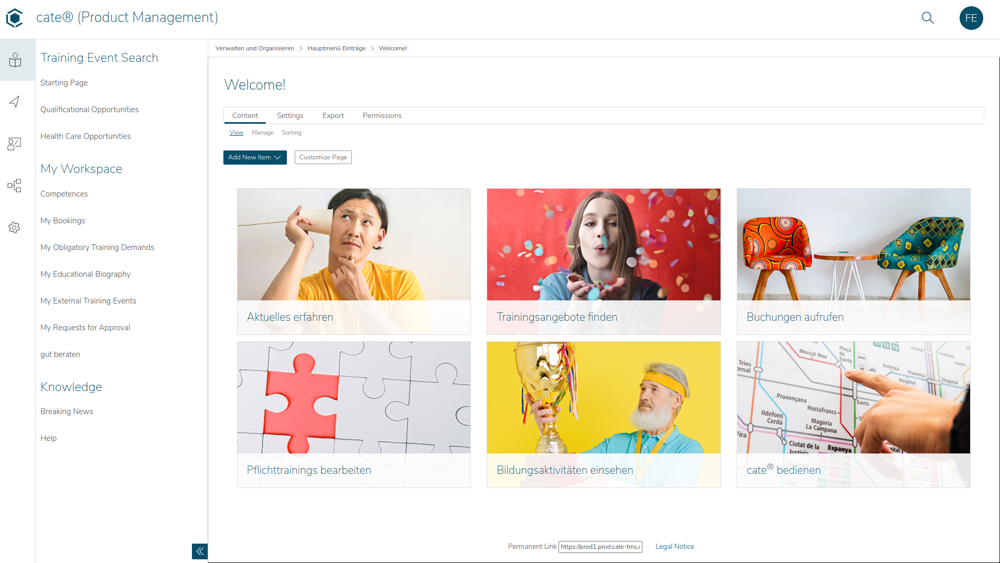
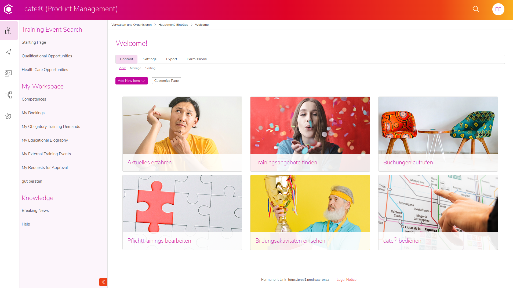

---

theme: cate-theme
paginate: false
header: ILIAS Conference 2024 | cate-tms.de
footer: No ILIAS on a dead planet.

---

<!-- _class: title-01 -->

<style>@import 'https://cdn.jsdelivr.net/npm/@tabler/icons@latest/iconfont/tabler-icons.min.css';</style>

# **Custom skins (system styles) in ILIAS 9+**

---

This is ILIAS

using delos

---

<!-- _footer: "" -->
<!-- _header: "" -->



---

This is cate, an extended ILIAS

and it can look very different...

---

<!-- _footer: "" -->
<!-- _header: "" -->



---

<!-- _footer: "" -->
<!-- _header: "" -->



---

You can make ILIAS look greatly different
* with custom skins (system styles)
* to better fit
  * your brand
  * your established UX patterns

---

<!-- _class: chapter-01 -->

## **Let's get to know each other**

---

Who here has ever changed the look of the ILIAS system style

* through the interface
* through committing style code to delos
* through a custom skin (system style)
* Who has never changed the look of ILIAS?

---

* Ferdinand Engländer - frontend-developer
* CaT Concepts and Training GmbH
* we run ILIAS instances modified and specialized for businesses
* insurances, car manufacturers, mid-size to large organizations,...
* our system cate has a base skin that we adapt to every client

---

Big changes are here in ILIAS 9

* end of 2019: proposal to move to ITCSS structure & from LESS to SASS pre-processor
* March 2023: ITCSS / SASS Coding Guidelines
* July 2023: Re-factoring LESS to SASS, ITCSS structure, removal/ingestion of Bootstrap 3
* thanks to CaT co-workers and University of Bern

---

<!-- _class: chapter-01 -->

## **Let's dive into creating a custom skin**

---

* needed/recommended tools
* simple: modifying variables at the entry point
  * great for changing a few colors, spacings and font settings
* advanced: forking delos
  * change anything (but keep the option to compare with and pull from delos)

---

<!-- _class: chapter-01 -->

## **Needed/recommended tools**

---

Development Environment

* run ILIAS on your local machine
* https://github.com/conceptsandtraining/doil

---

SASS pre-processor

* style code is written in SCSS syntax, SASS pre-processor turns it into CSS
* dart-sass is the most up-to-date sass variant
* pay attention what exact sass variant and version is installed by package managers

---

Browser dev tools
* clear cache

---

<!-- _class: chapter-01 -->

## **Simple: Changing Variables at the entry point**

---

### Enable custom styles

In 'ilias.ini.php'

```
enable_system_styles_management = "1"
```

---

### Adjust .gitignore

> Directories
> 
> /data
> ~~/Customizing/global~~
> /Customizing/clients
> virtual-data
> /libs/composer/vendor

---

### Create custom system style folder

Create folder 'Customizing/global/skin/myskin'

---

### Create template.xml

in 'Customizing/global/skin/myskin/'

```xml
<?xml version = "1.0" encoding = "UTF-8"?>
<template xmlns = "http://www.w3.org" version = "1" name = "MySkin">
  <style name = "MyStyle" id = "mystyle" image_directory = "images"/>
</template>
```

id is the CSS file name

---

### Create mystyle/mystyle.scss

---

###  Import delos with @use

```SCSS
@use "../../../../../templates/default/delos" as delos;
```

---

### Change variables on entry point using with()

```
@use "../../../../../templates/default/delos" as delos with (
      $il-main-color: #a52d2d,
);
```

---

### Fix icons and fonts

```scss
@use "../../../../../templates/default/delos" as delos with (
      $il-web-font-path: "../../../../../templates/default/fonts/",
      $il-background-images-path: "../../../../../templates/default/images/",
      $il-icon-font-path: "../../../../../templates/default/fonts/bootstrap/",
      $il-main-color: #a52d2d,
);
```

---

### Exploring the settings layer for more variables to change

* standard page background
* header color
* mainbar color

---

```scss
@use "../../../../../templates/default/delos" as delos with (
      $il-web-font-path: "../../../../../templates/default/fonts/",
      $il-background-images-path: "../../../../../templates/default/images/",
      $il-icon-font-path: "../../../../../templates/default/fonts/bootstrap/",
      $il-main-color: #a52d2d,
      $il-page-bg: #f6e7d8,
      $il-mainbar-btn-bg-color: #431a1a,
      $il-standard-page-header-bg-color: #f6d9a1,
);
```

---

### Overriding images

---

change logo

---

change dashboard icon

---

### Adding minor css tweaks

logo position

---

<!-- _class: chapter-01 -->

## **Advanced Skins (System Styles)**

---

### Fork delos

https://github.com/ILIAS-eLearning/delos/tree/release_9

---

* is automatically updated whenever the full ILIAS repo changes
* makes it easy to pull and diff changes from the unmodified delos
* opens up many possible pipelines and workflows:
  * good old copy paste
  * git clone
  * git subtree
  * git submodule

---

### Set up a subtree

At ILIAS root

```
                                sub-folder                                    repository                          branch  no history
git subtree add --prefix Customizing/global/skin/myskin/mystyle git@github.com:catenglaender/exampleSkinILIAS.git release_9 --squash
```

---

### Important Notes

* .gitignore of the parent is still active
* template.xml is needed
* id in template.xml is the expected CSS file name

---

### Overrides

* non-scss folders and files in Customizing/global/skin can be deleted
* ILIAS will then use the files of the same name from templates/default instead
* this allows you to override e.g. images and html templates selectively

---

### Commits

If you use git subtree:
don't mix subtree files and parent repo files in the same commit

---

### Push to the subtree

```
                                sub-folder                                    repository                           branch
git subtree push --prefix Customizing/global/skin/myskin/mystyle git@github.com:catenglaender/exampleSkinILIAS.git release_9
```

---

### Fonts

_settings_typography
_normalize_typography

---

### Panels

modifying modern UI component

removing padding

---

### Toolbar

override through a separate file

---

### Questions?

Good luck and have fun creating your skins!

---

Curious what else cate can do?

Creating mandatory training for business clients:
https://cate-tms.de/cate-erklaert.html

