---

marp: true
theme: cate-theme-dark
paginate: false
header: ILIAS DevConf March 2025 | cate-lms.de
footer: No ILIAS on a dead planet.
transition: explode

---

<!-- _class: title cate -->

# **Getting UI Components Done**

## **Going from Need to Feature in 4 Steps ⃰**

---

 ⃰ well, actually it's very often more than 4 steps and sometimes it's more of a hobble than an actual step. But there are better and worse ways to make progress and I think what I want to talk to you about today is actually going in a very good direction worth continuing.

---

<!-- _footer: '' -->
<!-- _header: '' -->
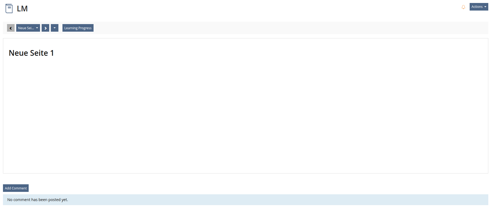

---

<!-- _footer: '' -->
<!-- _header: '' -->
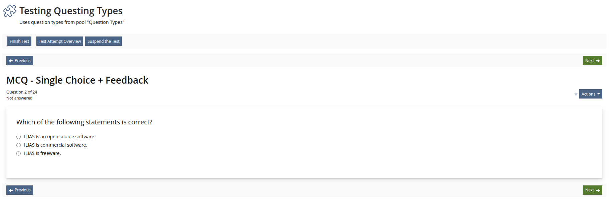

---

<!-- _footer: '' -->
<!-- _header: '' -->
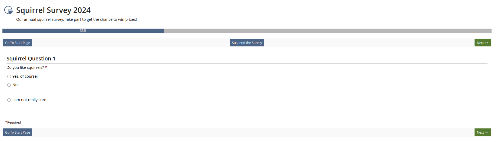

---

<!-- _footer: '' -->
<!-- _header: '' -->

3 screens controlling elements in a sequence

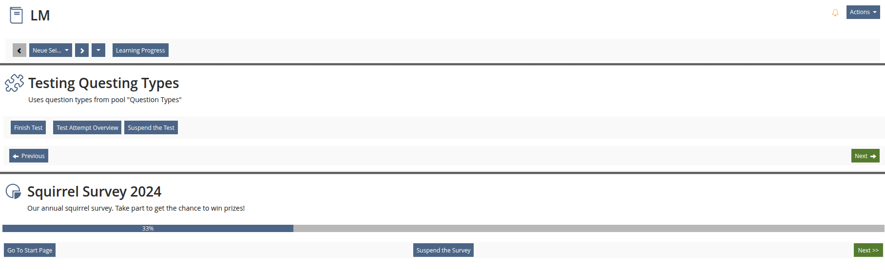

---

Ongoing spring cleaning: Removing LUI

We have to go over all of these screens

---

Time to question concepts

Identify user confusion & misunderstandings

---

New UI components

Screens (a bit) improved & (more) future-proof

---

## Ferdinand Engländer

Frontent Developer @ Concepts and Training GmbH
ILIAS Authority to Sign off on Concepts / Code Changes for CSS and templates

---

<!-- _class: chapter cate -->

## **Journey to UI components**

---

Anyone can contribute...

---

The ideal path

* the need
* shape concept & requirements
* separate what's out of scope
* create visual design that strengthens functionality

---

<!-- _class: chapter cate -->

## **Targets worth aiming for**

---

* considering many perspectives
* catching pitfalls early
* joining forces
* clear scope to keep working with purpose

---

<!-- _class: chapter cate -->
## **the need**

vs. the want ;)

---

### Feature Wiki (& Jour Fix 1)

Alexandra Toedt

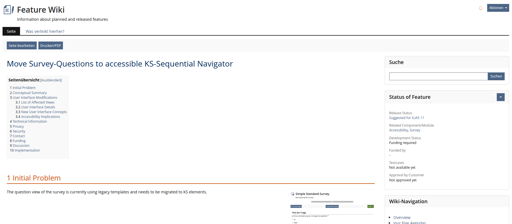

---

### Connection to other Removing LUI projects

* toolbar buttons have been sorted to other places
* test & assessment is gradually moving to UI components (result view, manual scoring, question pool data table)

---

### UI Clinic - 19.06. & 03.07.2024

Yvonne Seiler, Kendra Grotz, Kristina Auerswald, Ferdinand Engländer, Denis Strassner, Alexandra Tödt, Richard Klees, Stephan Kergomard

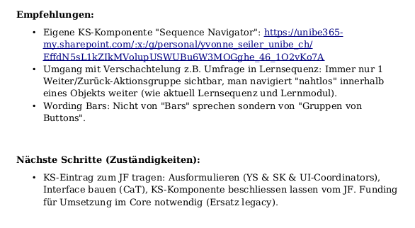

---

### Yvonne Seiler's notes

---

<!-- _footer: '' -->
<!-- _header: '' -->

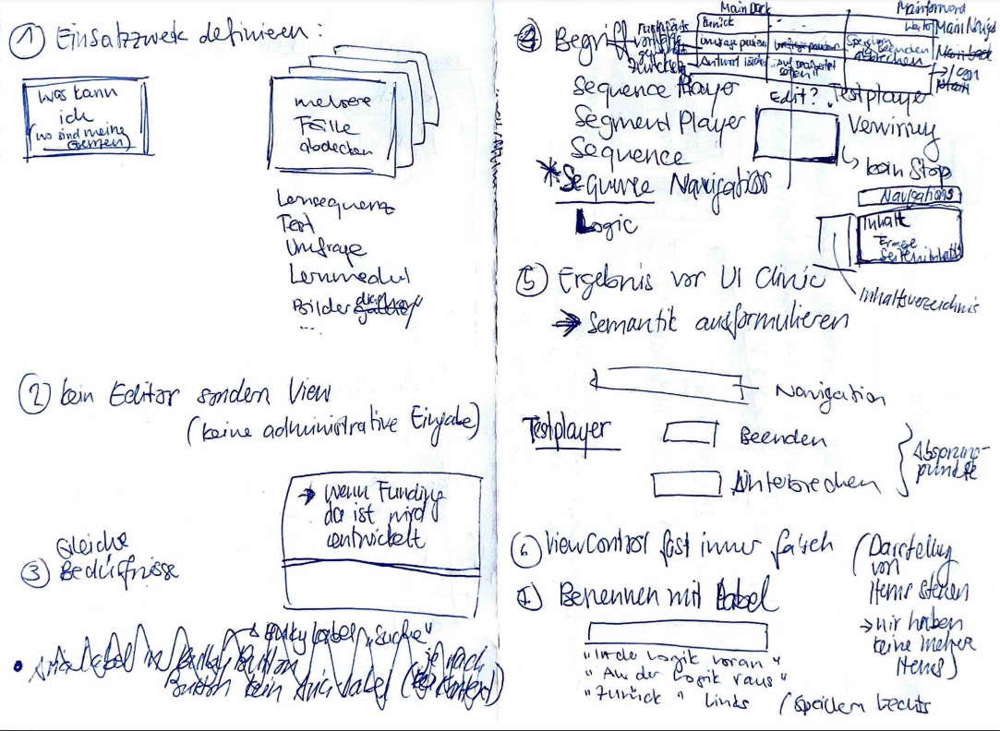

---

<!-- _footer: '' -->
<!-- _header: '' -->

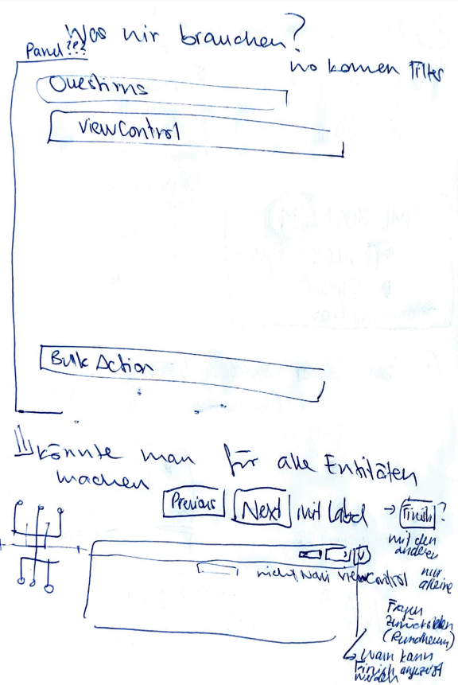

---

<!-- _class: chapter cate -->

## **Concepts & Requirements**

UI Component Sequence Navigation

---

### Kitchen Sink

* description
  * purpose
  * composition
  * effect
  * rivals
* rules
  * usage
  * interaction

---

### Detailed draft

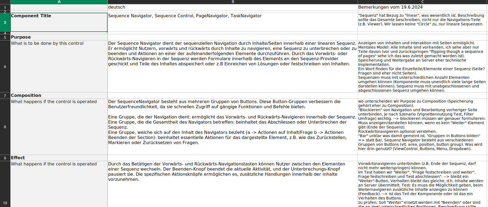

---

### php interface with Kitchen Sink description

[UI/src/Component/Navigation/factory.php in PR](https://github.com/ILIAS-eLearning/ILIAS/blob/5be2af8db079693bf7d560a241f841c05116f0ba/components/ILIAS/UI/src/Component/Navigation/Factory.php)

---

<!-- _class: chapter cate -->
## **Out of scope**

---

Let's be honest...

### Opinions, expectations and wishes clash

---

### A frequent compromise 

Separating use cases

Decision to do one thing well rather than many things badly

---

Answering one question, leads to 10 more.

---

### What about saving the form input inside a segment?

* Does clicking "next" save forms of the currently displayed element?
* If it doesn't, can there be an extra "save element" action?
* This is a **navigation** not an **input group** component

---

### Decision

* for THIS UI component defined as Sequence Navigator
  * focus on feeding a progressing, linear sequence segment by segment
* back/next do not carry out any additional actions
* for actions the consumer can add buttons
  * targeting outer context / all segments
  * targeting current segment

---

### Out of scope => Outlook

* this doesn't mean there couldn't be e.g. a Test/Survey Player UI component or a Form Wizard that saves draft states
  * but that needs clearly defined needs, concepts, funding

---

<!-- _class: chapter cate -->
## **Design**

---

* ideally, design should already be part of the earlier phases
* design is information architecture
  * what is seen first, second, third...
  * what is grouped together following user expectations

---

### Bare bones after implementation

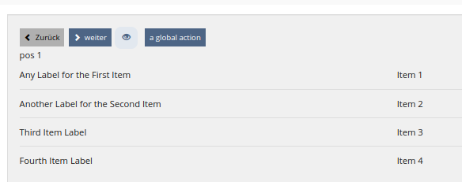

---

### Semantic groups

* Global context (all segments)
* Current segment
* Existing mental models
  * Button hierarchy (button default, button primary)
  * View Control, Pagination

---

### References

---

<!-- _footer: '' -->
<!-- _header: '' -->
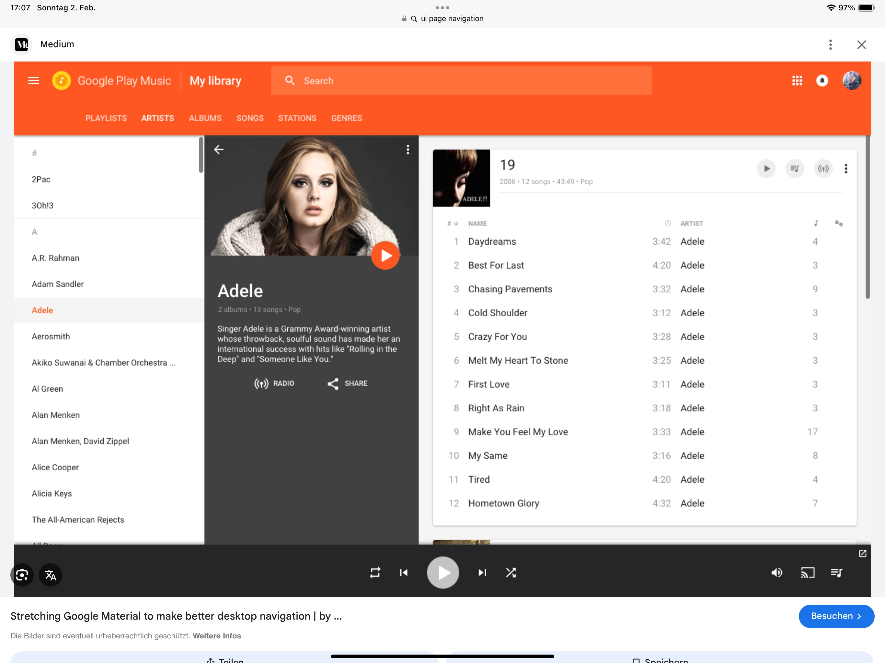

---

### Low fidelity mockups

by Yvonne Seiler

---

<!-- _footer: '' -->
<!-- _header: '' -->
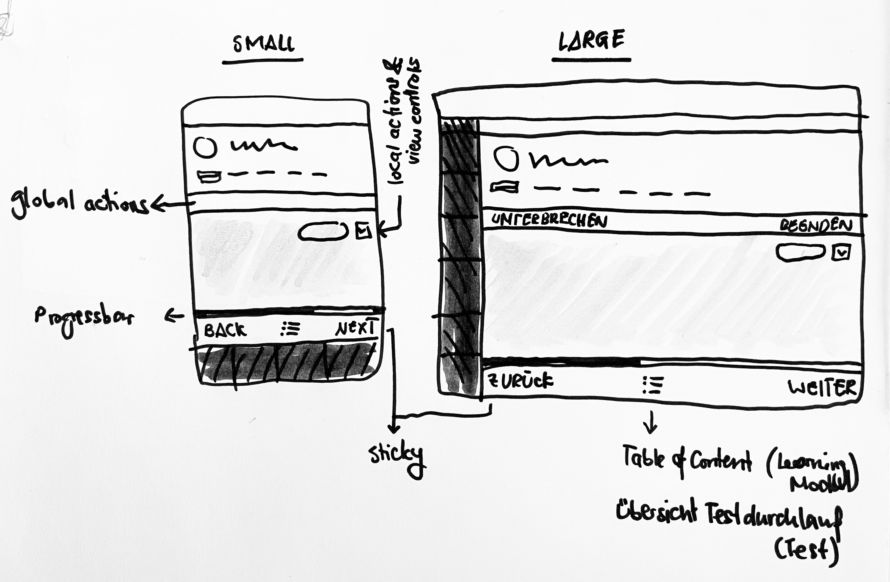

---

### HTML template & SCSS Code

---

<!-- _footer: '' -->
<!-- _header: '' -->
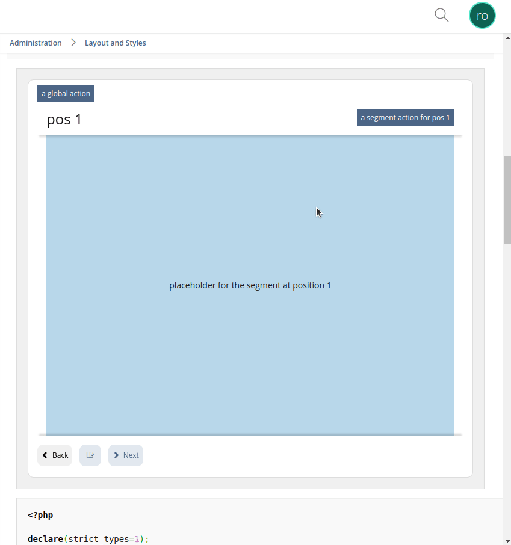

---

### Still on my to do list

* aria regions & controls

---

<!-- _class: chapter cate -->
## **Conclusion**

---

* clear discussion to concept to implementation workflow worked well in this case
* clear scope and limits kept project workload from exploding
* we have one working component that is great for the specific scope but can also go slightly beyond (action buttons)
* concepts that didn't make it in are a head start for future components or child components

---

Anyone is invited to participate.

Good UI components help all future projects.

---

<!-- _class: cate -->

## **Thank you**

Any questions?

### Kontakt
ferdinand.englaender@concepts-and-training.de

https://cate-lms.de
https://concepts-and-training.de
