---

marp: true
theme: cate-theme
paginate: false
header: ILIAS DevConf September 2023 | cate-tms.de
footer: No ILIAS on a dead planet.

---

<!-- _class: title-01 -->

# **Inside the Tab? Thinking outside the box!**

## **Improving the Tabs & Sub-Tabs navigation experience**

---

<!-- _class: chapter-02 -->

## **Diving into Tabs**

### **Tabs of Test & Assessment**

---

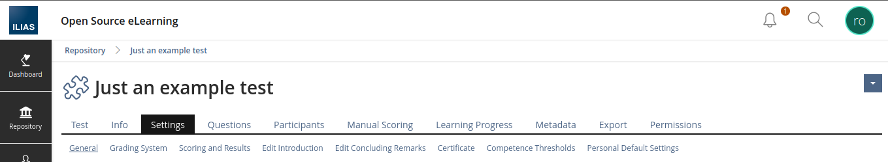

---

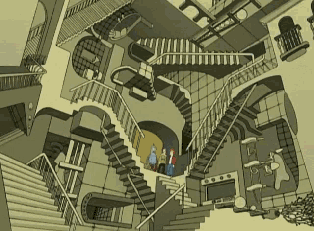

* many options
* power that users don't always need
* Overwhelming to beginners
* advanced users get used to it, but they too would appreciate getting more done faster.

---

## Path to more clarity and less misunderstandings

---

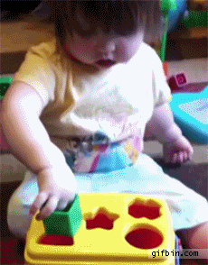

## Challenge: Giving the user what they expect

---

<!-- _class: chapter-01 -->

## **Proposal 1: Workflow & User Intent based Branching**

### **Work in Progress**

---

Cover page - opening an empty test

---

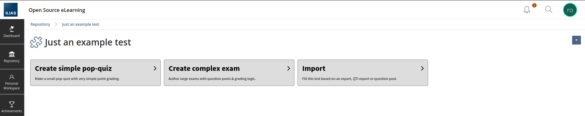

---

Declared simple pop-quiz creation intent

---

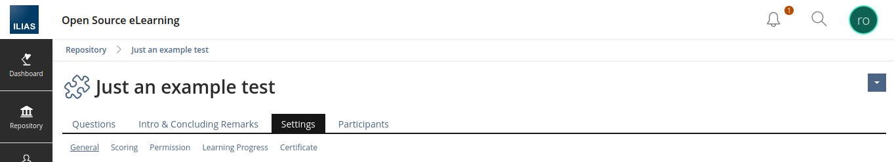

---

Declared complex exam creation intent

---

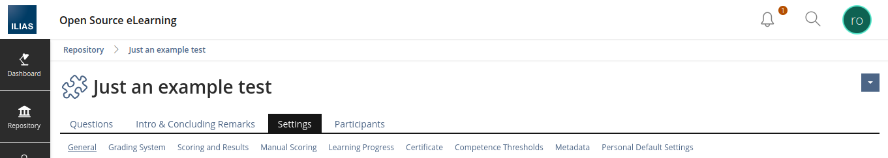

---

Cover page - opening a running test

---

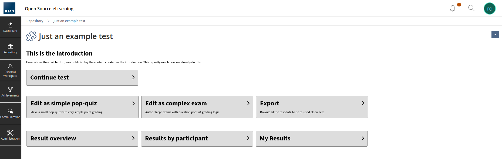

---

<!-- _class: chapter-01 -->

## **Proposal 2: Mode of Thinking based Branching**

### **Work in Progress**

---

### Base-Structure

* View
* Edit
* Assign
* Settings
* Evaluate

---

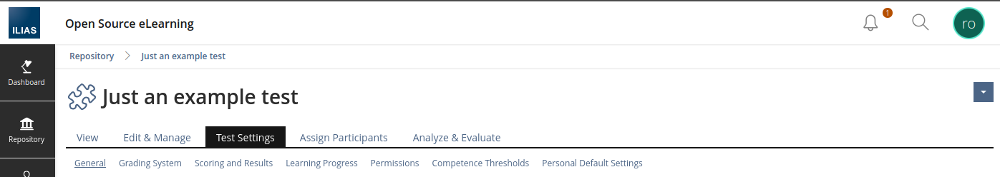

---

<!-- _class: chapter-02 -->

## **About this Presentation**

---

* Tabs & Sub-Tabs Status-Quo
* UI/UX theories, studies and metrics - no gut feeling, no personal taste
* Approaches to make Tab Navigation faster & avoid frustrations
* learnings and lessons you can apply to any of your projects

---

## Ferdinand Engländer

* Frontend Developer @ Concepts and Training GmbH, Cologne
* cate LMS: Our modified ILIAS specialized for medium & large companies
* ILIAS CSS Authority

---

<!-- _class: chapter-02 -->

## **Origins & Workshop**

---

### Issues

* Users give feedback
  * felt lost
  * took a long time to figure sth. out
  * confused by unexpected behavior

---

### Previous Guidelines

* a [Feature Wiki entry from 2010](https://docu.ilias.de/ilias.php?baseClass=ilwikihandlergui&cmdNode=16g:rq&cmdClass=ilobjwikigui&cmd=viewPage&ref_id=1357&page=Tabs_Guideline)
* and a Project to [Streamline Sub-Tabs](https://docu.ilias.de/ilias.php?baseClass=ilwikihandlergui&cmdNode=16g:rq&cmdClass=ilobjwikigui&cmd=viewPage&ref_id=1357&page=Streamline_%28Sub-%29Tabs)
* some good thoughts on order and consistency, but little depth and grounding in data and UX best practices

---

### Workshop

* July 2025, one entire day
* members from CaT, University of Bern, University Hohenheim
* content
  * identified obstacles and inconsistencies that might confuse users
  * experimented with alternative and refined structures to simplify and enhance tab navigation
  * brainstormed how the new approaches would work in different areas of ILIAS

---

### Paper

* writing down findings from the workshop
* expanding on possible solutions

---

<!-- _class: chapter-02 -->

## **Good UX is not taste, but can be measured**

---

### Time

* "In most situations, the faster a user can complete a task, the better the experience." <small>Tom Tullis, Bill Albert. Measuring the User Experience.</small>

---

### Number of Actions & lostness

* clicks and triggers require physical and mental activity
* lowering the number of total actions **feels better and less straining**
* lostness
  * "The total number of pages visited while performing the task, counting revisits to the same page" versus "The minimum (optimum) number of pages that must be visited to accomplish the task" <small>Tom Tullis, Bill Albert. Measuring the User Experience.</small>

---

### User Intent and Mental Model

* the **user intent**: "the purpose of a user’s series of actions" <small>[Ciprian Borodescu. A gentle introduction to orchestrating intelligent journeys with User Intent Graphs.](https://uxdesign.cc/a-gentle-introduction-to-orchestrating-intelligent-journeys-with-user-intent-graphs-503192a637e2)</small>
* the **mental model**: "what users know (or think they know) about a system" <small>[Jakob Nielsen. Mental Models.](https://www.nngroup.com/articles/mental-models/)</small>

---

### Memory for 7 +/- 2 chunks

* "In 1956, [George A.] Miller found that most people can remember about 7 chunks of information in their short-term memory."
* 982184652390 vs. 9821 8465 2390
* grouping

---

<!-- _class: chapter-02 -->

## **Analyzing Issues**

---

We focused on the following areas of ILIAS:

* Test & Assessment
* Question
* Course
* Administration > System Settings > General Settings
* Administration > Repository & Objects > Repository
* Administration > Repository & Objects > Study Programme
* Category
* ILIAS Learning Module
* Wiki

---

### Color coded screen

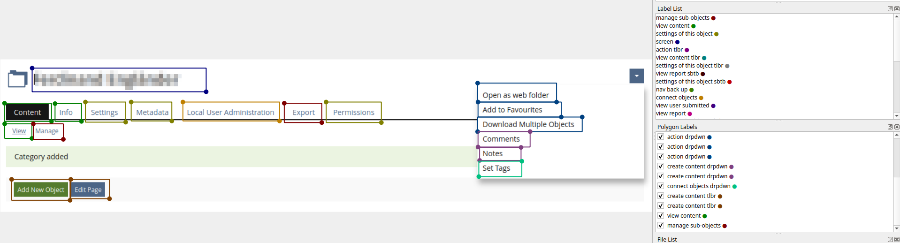

---

We landed on the following categories:
* Settings of this object: Settings, General, Grading System, Permissions
* View/Work-Through Content: Test
* View/Work-Through Reports: My Result
* Create content: Edit introduction
* Manage/create sub-objects: Questions, Export
* Connect this object with other objects: Participants

* We also found in other views...
  * Actions (immediately trigger a change in data)
  * Navigation Back or Up

---

### Reality check

* What counts as an object or sub-object?
  * Anything that feels like an object to the user
  * Calendar, Question, Comment
* What counts as a setting?
  * Anything that feels like it sets up how the object behaves
  * Permissions, Learning Progress

---

* What counts as content?
    * Created/uploaded elements like texts or images
    * later shown again verbatim to the same/other users
    * to be read/interacted with
    * Questions is sub-object, Question Text is content

---

### We need to think like the user

* Mental Model vs. Implementation Model
* "The implementation model represents how a system (application, service, interface, etc.) works. [...] It is shaped by technical, organizational, and business constraints." <small>[Vibor Cipan. 2020, September 27. UX mental model, implementation and represented models in UX.](https://pointjupiter.com/ux-mental-model-representation-implementation-user-experience-development/)</small>
* ILIAS UI is often a list of functions of the implementation model

---

Example for Mental Model: Booking a flight

---

* interface is very simple: from, to, dates, number of people,...
* implementation is highly complex: checking different airlines, connections

---

### Measuring the status quo

* 20 screens (view with the same header inside an object)
* Main Tabs only counted once per screen
* Tabs with same name and different screens are counted again

---

### Result

|                           | Tabs | Sub-Tabs | Toolbar | Top-Right Dropdown |
|---------------------------|------|----------|---------|--------------------|
| View/Work-Through Content | 26   | 3        | 11      | 1                  |
| View/Work-Through Reports | 4    | 9        |         |                    |
| Manage Sub-Objects        | 35   | 16       | 1       |                    |
| Create Content            | 4    | 7        | 17      | 6                  |
| Connect Objects           | 5    | 2        |         | 2                  |
| Settings of this Object   | 53   | 13       | 2       | 1                  |
| Actions                   | 2    | 3        | 26      | 5                  |
| Navigation back or up     | 8    |          |         |                    |

---

### What are Tabs for?

> "In-page tabs organize and present related content within a single page. These tabs are not for navigation but enable users to alter the content displayed in the panel."

<small>Evan Sunwall. Tabs, Used Right. nngroup.com. August 2nd, 2024. https://www.nngroup.com/articles/tabs-used-right/</small>

---

> "Navigation tabs enable users to navigate to different pages. Because navigation usability improves when the user’s location is clearly marked, designers started using the visual presentation of tabs (in particular, selection indicators) for navigation controls. Over time, this tab styling became a common visual approach to navigation."

<small>Evan Sunwall. Tabs, Used Right. nngroup.com. August 2nd, 2024. https://www.nngroup.com/articles/tabs-used-right/</small>

---

### Outliers

---

### Mix of Layers: Back Tab

---

#### Rivals to Tab expectation

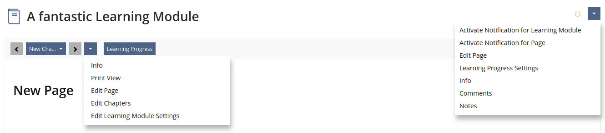

---

#### Inside Out Settings

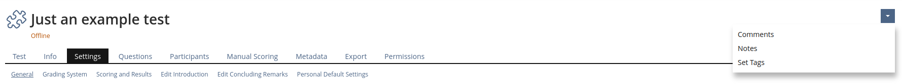

---

#### Action as Tabs

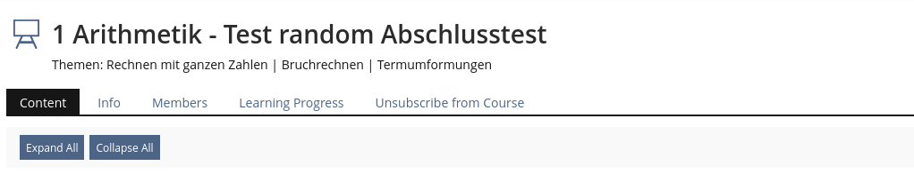

---

<!-- _class: chapter-02 -->

## **Refining Tab Architecture**

---

### Goals

* Semantic and Concern Separation: Can we split different types of options into groups or layers?
* User Intent over Implementation Model: While ILIAS screens give a good overview over the functionality, they do not adapt to current User Intent
* Supporting concepts and development with smart systems: Any solutions we find to segment or adapt the UI must not burden developers.

---

### Approach 1: User Intent at the top of the hierarchy

* UI following User Intent feels most frictionless
* But how can I be sure what the current intent is?
* Let the User tell us: Putting User Intent at the top of the hierarchy

---

---

---

### Let's brainstorm together...

What are the User Intents for a Course?

They might come up at later points for different roles.

---

Are there some Tabs that clearly belong to only one User Intent?

Which Tabs belong to multiple?

---

### Approach 2: General User Intent

* View (Explore / Learn / Launch)
* Edit (Create / Manage) {Name of (Sub-Object)}
* Assign (Connect) {Sub-Object}
* {Object Name} Settings
* Evaluate (Analyze)

---

#### View (Explore / Learn / Launch)

* Content just to view without or with very little interaction
* Content for the user to interact with and work through (e.g. a test)
* adding Sub-Objects and items while interacting with created content (e.g. comments)

---

#### Edit (Create / Manage) {Name of (Sub-Object)}

* Page Editor Content
* Sub-Objects like Repository Objects served as part of the content
* Sub-Objects or items making up a sequence or segmented collection of contents (Questions, Blog-Posts)
* Templates e.g. for Certificates

---

#### Assign (Connect)

Whenever one object needs to be paired with another like...
* assigning Users as Participants or Members
* connecting Qualifications with Questions

---

##### {Object Name} Settings

Anything that can be changed about the current (sub-)object and how it behaves (excluding what content is in it or what is connected to it).
* Settings of Behavior (how to serve content, how to process User interaction)
* Availability
* Permissions
* Learning Progress Settings (how it is tracked)

---

#### Evaluate (Analyze)

Analytics and Reports. Content and sub-object created by the consuming user that are part of an evaluation process (Test Answers, Survey Answers)
* Data & Statistics generated from User interaction with the object and its sub-objects
* Data and content submitted by a consuming User
* Learning Progress (what was tracked)
* Manual Scoring

---

<!-- _class: chapter-02 -->

## **Minimum Tweaks**

### **The minimum action we would recommend is to clean up worst offenders**

---

* "back" or "back up" buttons should move out of the Tab area
* avoid duplicated options across Toolbar, Tabs, Sub-Tabs and Dropdowns
* reduce number of Tabs and move content into Sub-Tabs where possible
* Actions should never be in the Tab as both Mental Models for Tabs only reveal or go to content.
* Toolbar and Dropdown Actions should not lead to a settings page. Settings pages are clearly the main purpose of Tabs.
* the Toolbar location is deprecated as part of the Removing LUI projects (e.g. attach them to the Table component that they control)

---

## Conclusion

* ILIAS could benefit from bringing User Intent into the interface.
* Tabs are still one of the best ways to navigate between a collections of views.
* A break in a pattern indicates that a system or grouping could be optimized.
* By following User Intent we can sort and nest Tabs in ways that feel more intuitive and frictionless to our users.

---

Lots to do, let's stay in touch

* ferdinand@concepts-and-training.de
* CSS Squad in the ILIAS Discord Server
